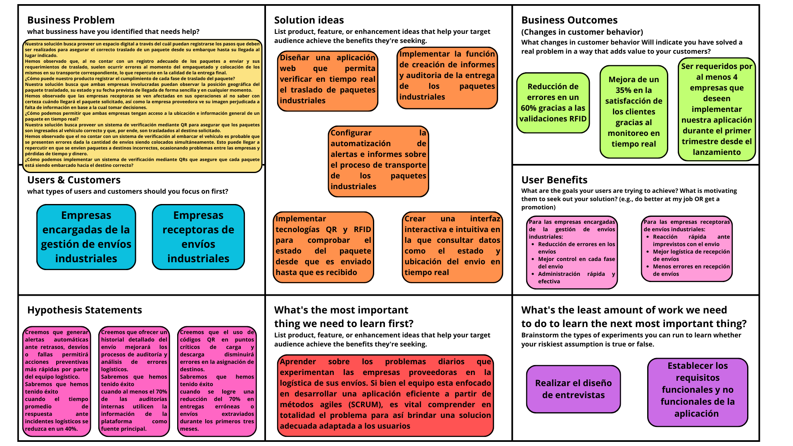
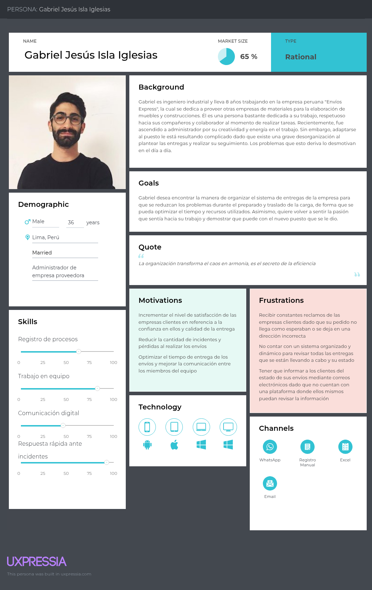
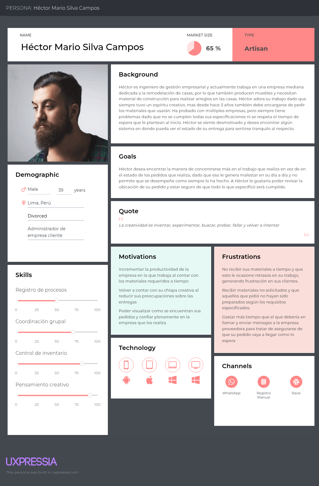
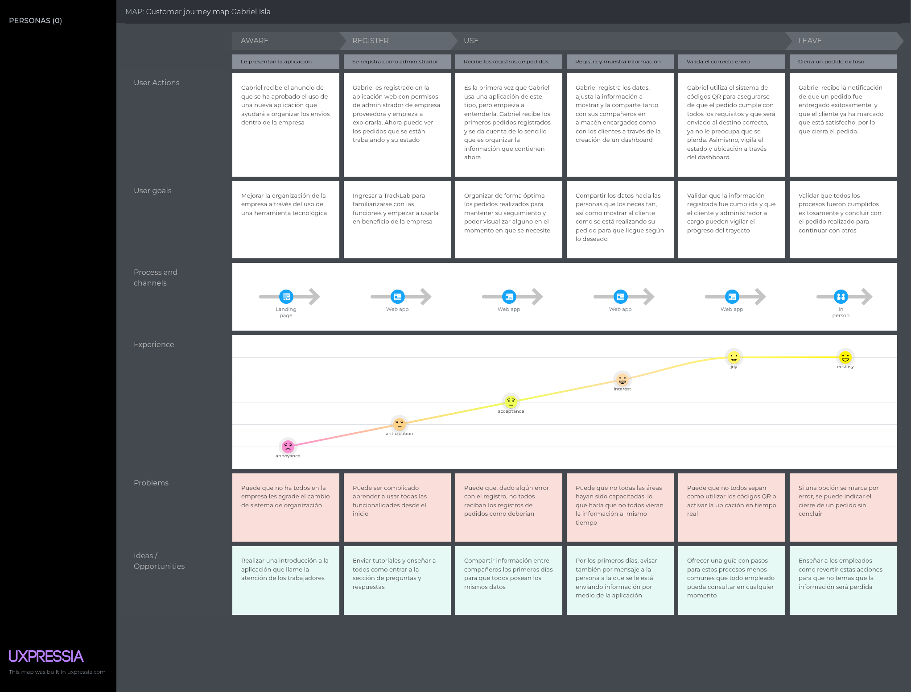
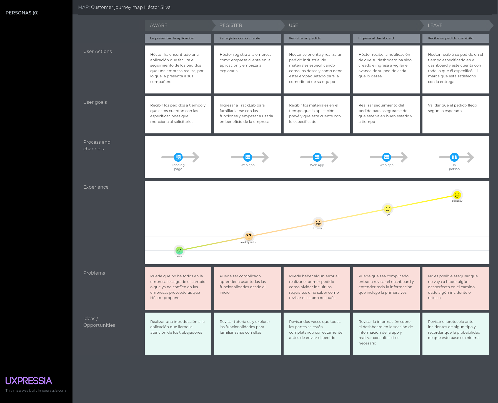
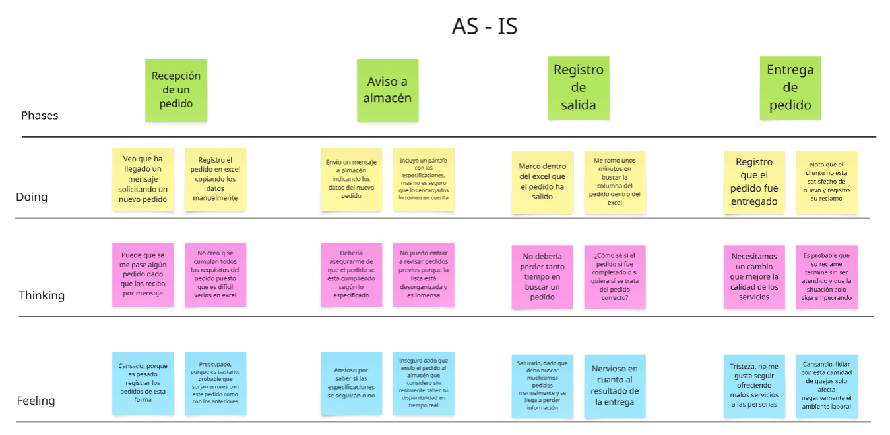
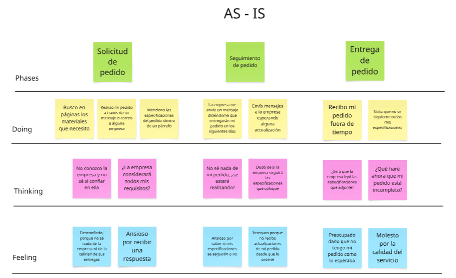
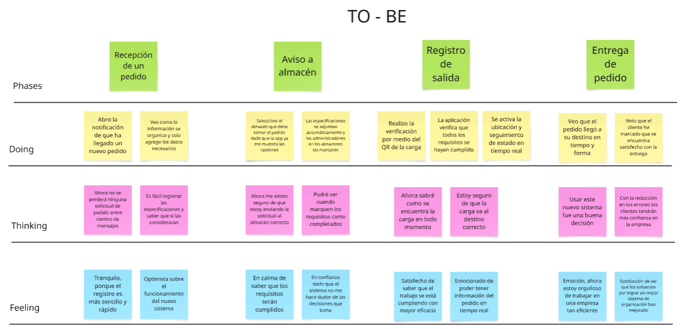
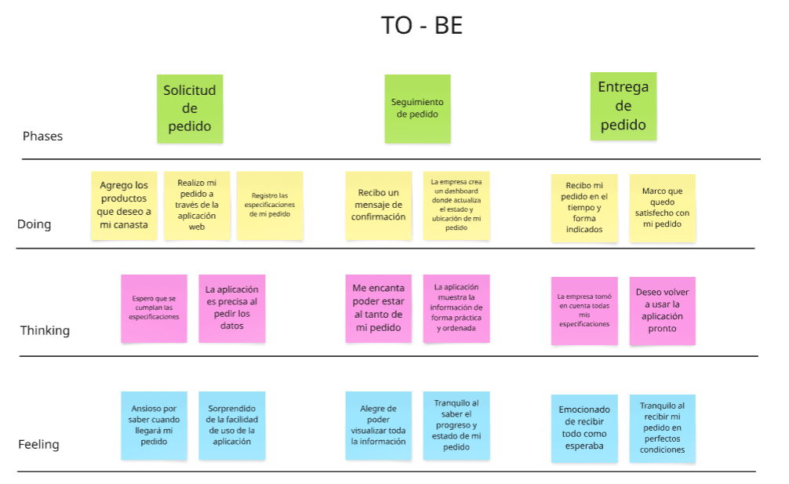
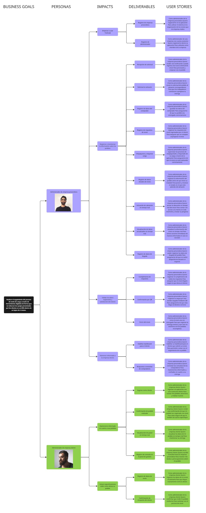

# Informe del Trabajo Final

  

  
<b>Informe de Trabajo Final</b>

  
Facultad de Ingeniería

  
Universidad Peruana de Ciencias Aplicadas

  
Ingeniería de Software

  
Aplicaciones Web

  
4363

  
Alex Humberto Sánchez Ponce

  
Startup: AlumWare

  
Producto: TrackLab

---

## Team members:

| **Nombre**                       | **Código** |
| ---------------------------------|------------|
| Roman Cruz, Natalia Bertha       | U202310148 |
| Solano Armas, Angelo Hector      | U20231B775 |
| Iglesias Pérez, Sergio Sebastián | U202316118 |
| Baldeón Vivar, Santiago Armando  | U202319881 |
| Céspedes Pillco, Jarod Jack      | U202318588 |

  
<b>Ciclo 2025 - 01</b>

---

## Versiones del Informe

| _Versión_ | _Fecha_    | _Autor_ | _Descripción de modificación_ |
| --------- | ---------- | ------- | ----------------------------- |
| 1.0       | 06/04/2025 | Iglesias Pérez, Sergio Sebastián | Creación del repositorio |
| 1.1       | 13/04/2025 | Roman Cruz, Natalia Bertha       | Capítulos I (sin entrevistas), Capítulo II (ubiquitous language) y Capítulo 3 (hasta 3.2) |

---

## Project Report Collaboration Insights

URL del repositorio para el reporte del proyecto: FALTA LANDING PAGE

**TB1**

Para el desarrollo del informe pertinente a la TB1, se dividió la implementación de sencciones de la siguiente forma entre los integrantes del grupo:

| **Integrantes**                  | **Tareas asignadas** |
| ---------------------------------|----------------------|
| Roman Cruz, Natalia Bertha       | Antescedentes y problemática, Problem Statements, Análisis de Entrevistas, Needfinding, Requirements Specification, Organization y Laling systems, Wireflow diagrams, Domain-Driven Software Architecture, Database diagram, Class diagram, Team Collaboration Insights, landing page, conclusiones, recomendaciones |
| Solano Armas, Angelo Hector      | Assumptions, Hypthesys statements, Análisis de Entrevistas, Needfinding, Requirements Specification, searching y navigation systems, wireframes, Domain-Driven Software Architecture, Database diagram, Class diagram, aspect leaders and collaborators, development evidence for sprint, landing page |
| Iglesias Pérez, Sergio Sebastián | Descripción del Startup, segmentos objetivos, registro de entrevistas, style guidelines, wireframes, mockup, prototype, context diagram, Software Development Environment Configuration, landing page |
| Baldeón Vivar, Santiago Armando  | Canvas, Diseño de entrevistas, style guidelines, wireframes, mockup, class dictionary, Source Code Style Guide & Conventions, Sprint Backlog 1, edición del video |
| Céspedes Pillco, Jarod Jack      | Competidores, SEO Tags and Meta Tags, User Flow Diagrams, Software Configuration Management, Services Documentation Evidence for Sprint Review |

El proceso de colaboración durante el informe se realizó tanto con commits como compartiendo avances a través de documentos de google. 

---

## Github Collaboration Insights

Github también presenta un timeline de las ramas principales y los procesos de merge a los que se han sometido. Todas las ramas se crearon tomando en cuenta el diseño de GitFlow para una buena organización cuando se usa un software de control de versiones.

Se puede identificar a los integrantes como: 
- Roman Cruz, Natalia Bertha: natRC2005
- Solano Armas, Angelo Hector: Angelo5214
- Iglesias Pérez, Sergio Sebastián: ghostrider101218
- Baldeón Vivar, Santiago Armando: Santibal11
- Céspedes Pillco, Jarod Jack: PruebaJJC

Asimismo, se explican las ramas que tenemos hasta el momento: FALTA COMPLETAR E IMAGEN
- main:
- readme-updates:

**ESPACIO PARA LA IMAGEN**

Los siguientes gráficos muestran analíticos en cuanto a los commits que cada integrante del grupo ha estado realizando en el repositorio.

__TB1__

**ESPACIO PARA LA IMAGEN**

---

## Students Outcomes

| _Criterios específicos_ | _Acciones realizadas_ | _Conclusiones_ |
| ----------------------- | ------------------------------------------------------------ | -------------- |
| Trabaja en equipo para proporcionar liderazgo en forma conjunta | Roman Cruz, Natalia Bertha  TB1 - Antecedentes y problemática  - Lean UX Problem Statements  - Análisis de entrevistas  - Needfinding  - Requirements Specification  - Organization Systems  - Labeling Systems  - Web Applications Wireflow Diagrams  - Domain-Driven Software Architecture  - Software Object-Oriented Design  - Database Design  - Team Collaboration Insights during Sprint  - Landing page  - Conclusiones  - Recomendaciones    Solano Armas, Angelo Hector  TB1   Iglesias Pérez, Sergio Sebastián  TB1   Baldeón Vivar, Santiago Armando  TB1   Céspedes Pillco, Jarod Jack  TB1  | Al haber concluido con la primera entrega, podemos concluir que logramos coordinar nuestros tiempos y responsabilidades como equipo para apoyarnos entre todos y presentar un trabajo que cumpla con todos los requisitos especificados. Establecimos una coordinación óptimo que nos permitió profundizar los conocimientos aplicados, así como practicar nuevas habilidades apoyándonos uno al otro. |
| Crea un entorno colaborativo e inclusivo, establece metas, planifica tareas y cumple objetivos | Roman Cruz, Natalia Bertha  TB1 - Antecedentes y problemática  - Lean UX Problem Statements  - Análisis de entrevistas  - Needfinding  - Requirements Specification  - Organization Systems  - Labeling Systems  - Web Applications Wireflow Diagrams  - Domain-Driven Software Architecture  - Software Object-Oriented Design  - Database Design  - Team Collaboration Insights during Sprint  - Landing page  - Conclusiones  - Recomendaciones    Solano Armas, Angelo Hector  TB1   Iglesias Pérez, Sergio Sebastián  TB1   Baldeón Vivar, Santiago Armando  TB1   Céspedes Pillco, Jarod Jack  TB1  | Al termino de la TB1, podemos concluir que conseguimos formar un entrno de colaboración, a través del cual podíamos realizar consultas entre compañeros mientras nos asegurábamos de cumplir con nuestros aportes a tiempo y de llegar a alcanzar nuestros objetivos de aprendizaje iniciales. Por otro lado, consideramos que la planificación, aunque siempre puede mejorarse, nos ayudó a tener suficiente tiempo como para volver a revisar ciertos detalles y mejorar la calidad de la entrega. |

---

# Contenido

1. __[Capítulo I: Introducción](#Capítulo-i-Introducción)__  
   1.1. [Startup Profile](#11-startup-profile)  
   &nbsp;&nbsp;&nbsp;&nbsp;1.1.1. [Descripción del startup](#111-descripción-del-startup)  
   &nbsp;&nbsp;&nbsp;&nbsp;1.1.2. [Perfiles de los integrantes del equipo](#112-perfiles-de-los-integrantes-del-equipo)  
   1.2. [Solution Profile](#12-solution-profile)  
   &nbsp;&nbsp;&nbsp;&nbsp;1.2.1. [Antecedentes y Problemática](#121-antecedentes-y-problemática)  
   &nbsp;&nbsp;&nbsp;&nbsp;1.2.2. [Lean UX Process](#122-lean-ux-process)  
   &nbsp;&nbsp;&nbsp;&nbsp;&nbsp;&nbsp;&nbsp;&nbsp;1.2.2.1. [Lean UX Problem Statements](#1221-lean-ux-problem-statements)  
   &nbsp;&nbsp;&nbsp;&nbsp;&nbsp;&nbsp;&nbsp;&nbsp;1.2.2.2. [Lean UX Assumptions](#1222-lean-ux-assumptions)  
   &nbsp;&nbsp;&nbsp;&nbsp;&nbsp;&nbsp;&nbsp;&nbsp;1.2.2.3. [Lean UX Hypothesis Statements](#1223-lean-ux-hypothesis-statements)  
   &nbsp;&nbsp;&nbsp;&nbsp;&nbsp;&nbsp;&nbsp;&nbsp;1.2.2.4. [Lean UX Canvas](#1224-lean-ux-canvas)  
   1.3. [Segmentos objetivo](#13-segmentos-objetivo)  
2. __[Capítulo II: Requirements Elicitation & Analysis](#capítulo-ii-requirements-elicitation--analysis)__
   2.1. [Competidores](#21-competidores)  
   &nbsp;&nbsp;&nbsp;&nbsp;2.1.1. [Análisis competitivo](#211-análisis-competitivo)  
   &nbsp;&nbsp;&nbsp;&nbsp;2.1.2. [Estrategias y tácticas frente a competidores](#212-estrategias-y-tácticas-frente-a-competidores)  
   2.2. [Entrevistas](#22-entrevistas)  
   &nbsp;&nbsp;&nbsp;&nbsp;2.2.1. [Diseño de entrevistas](#221-diseño-de-entrevistas)  
   &nbsp;&nbsp;&nbsp;&nbsp;2.2.2. [Registro de entrevistas](#222-registro-de-entrevistas)  
   &nbsp;&nbsp;&nbsp;&nbsp;2.2.3. [Análisis de entrevistas](#223-análisis-de-entrevistas)  
   2.3. [Needfinding](#23-needfinding)  
   &nbsp;&nbsp;&nbsp;&nbsp;2.3.1. [User Personas](#231-user-personas)  
   &nbsp;&nbsp;&nbsp;&nbsp;2.3.2. [User Task Matrix](#232-user-task-matrix)  
   &nbsp;&nbsp;&nbsp;&nbsp;2.3.3. [User Journey Mapping](#233-user-journey-mapping)  
   &nbsp;&nbsp;&nbsp;&nbsp;2.3.4. [Empathy Mapping](#234-empathy-mapping)  
   &nbsp;&nbsp;&nbsp;&nbsp;2.3.5. [As-is Scenario Mapping](#235-as-is-scenario-mapping)  
3. __[Capítulo III: Requirements Specification](#capítulo-iii-requirements-specification)__  
   3.1. [To-Be Scenario Mapping](#31-to-be-scenario-mapping)  
   3.2. [User Stories](#32-user-stories)  
   3.3. [Impact Mapping](#33-impact-mapping)  
   3.4. [Product Backlog](#34-product-backlog)
4. __[Capítulo IV: Product Design](#capítulo-iv-product-design)__
   4.1. [Style Guidelines](#41-style-guidelines)  
   &nbsp;&nbsp;&nbsp;&nbsp;4.1.1. [General Style Guidelines](#411-general-style-guidelines)  
   &nbsp;&nbsp;&nbsp;&nbsp;4.1.2. [Web Style Guidelines](#412-web-style-guidelines)  
   4.2. [Information Architecture](#42-information-architecture)  
   &nbsp;&nbsp;&nbsp;&nbsp;4.2.1. [Organization Systems](#421-organization-systems)  
   &nbsp;&nbsp;&nbsp;&nbsp;4.2.2. [Labeling Systems](#422-labeling-systems)  
   &nbsp;&nbsp;&nbsp;&nbsp;4.2.3. [SEO Tags and Meta Tags](#423-seo-tags-and-meta-tags)  
   &nbsp;&nbsp;&nbsp;&nbsp;4.2.4. [Searching Systems](#424-searching-systems)  
   &nbsp;&nbsp;&nbsp;&nbsp;4.2.5. [Navigation Systems](#425-navigation-systems)  
   4.3. [Landing Page UI Design](#43-landing-page-ui-design)  
   &nbsp;&nbsp;&nbsp;&nbsp;4.3.1. [Landing Page Wireframe](#431-landing-page-wireframe)  
   &nbsp;&nbsp;&nbsp;&nbsp;4.3.2. [Landing Page Mock-up](#432-landing-page-mock-up)  
   4.4. [Web Applications UX/UI Design](#44-web-applications-uxui-design)  
   &nbsp;&nbsp;&nbsp;&nbsp;4.4.1. [Web Applications Wireframes](#441-web-applications-wireframes)  
   &nbsp;&nbsp;&nbsp;&nbsp;4.4.2. [Web Applications Wireflow Diagrams](#442-web-applications-wireflow-diagrams)  
   &nbsp;&nbsp;&nbsp;&nbsp;4.4.3. [Web Applications Mock-ups](#443-web-applications-mock-ups)  
   &nbsp;&nbsp;&nbsp;&nbsp;4.4.4. [Web Applications User Flow Diagrams](#444-web-applications-user-flow-diagrams)  
   4.5. [Web Applications Prototyping](#45-web-applications-prototyping)  
   4.6. [Domain-Driven Software Architecture](#46-domain-driven-software-architecture)  
   &nbsp;&nbsp;&nbsp;&nbsp;4.6.1. [Software Architecture Context Diagram](#461-software-architecture-context-diagram)  
   &nbsp;&nbsp;&nbsp;&nbsp;4.6.2. [Software Architecture Container Diagrams](#462-software-architecture-container-diagrams)  
   &nbsp;&nbsp;&nbsp;&nbsp;4.6.3. [Software Architecture Components Diagrams](#463-software-architecture-components-diagrams)  
   4.7. [Software Object-Oriented Design](#47-software-object-oriented-design)  
   &nbsp;&nbsp;&nbsp;&nbsp;4.7.1. [Class Diagrams](#471-class-diagrams)  
   &nbsp;&nbsp;&nbsp;&nbsp;4.7.2. [Class Dictionary](#472-class-dictionary)  
   4.8. [Database Design](#48-database-design)  
   &nbsp;&nbsp;&nbsp;&nbsp;4.8.1. [Database Diagram](#481-database-diagram)  
5. __[Capítulo V: Product Implementation, Validation & Deployment](#capítulo-v-product-implementation-validation--deployment)__
5.1. [Software Configuration Management](#51-software-configuration-management)  
   &nbsp;&nbsp;&nbsp;&nbsp;5.1.1. [Software Development Environment Configuration](#511-software-development-environment-configuration)  
   &nbsp;&nbsp;&nbsp;&nbsp;5.1.2. [Source Code Management](#512-source-code-management)  
   &nbsp;&nbsp;&nbsp;&nbsp;5.1.3. [Source Code Style Guide & Conventions](#513-source-code-style-guide--conventions)  
   &nbsp;&nbsp;&nbsp;&nbsp;5.1.4. [Software Deployment Configuration](#514-software-deployment-configuration)  
   5.2. [Landing Page, Services & Applications Implementation](#52-landing-page-services--applications-implementation)  
   &nbsp;&nbsp;&nbsp;&nbsp;5.2.1. [Sprint 1](#521-sprint-1)  
   &nbsp;&nbsp;&nbsp;&nbsp;&nbsp;&nbsp;&nbsp;&nbsp;5.2.1.1. [Sprint Planning 1](#5211-sprint-planning-1)  
   &nbsp;&nbsp;&nbsp;&nbsp;&nbsp;&nbsp;&nbsp;&nbsp;5.2.1.2. [Sprint Backlog 1](#5212-sprint-backlog-1)  
   &nbsp;&nbsp;&nbsp;&nbsp;&nbsp;&nbsp;&nbsp;&nbsp;5.2.1.3. [Development Evidence for Sprint Review](#5213-development-evidence-for-sprint-review)  
   &nbsp;&nbsp;&nbsp;&nbsp;&nbsp;&nbsp;&nbsp;&nbsp;5.2.1.4. [Testing Suite Evidence for Sprint Review](#5214-testing-suite-evidence-for-sprint-review)  
   &nbsp;&nbsp;&nbsp;&nbsp;&nbsp;&nbsp;&nbsp;&nbsp;5.2.1.5. [Execution Evidence for Sprint Review](#5215-execution-evidence-for-sprint-review)  
   &nbsp;&nbsp;&nbsp;&nbsp;&nbsp;&nbsp;&nbsp;&nbsp;5.2.1.6. [Services Documentation Evidence for Sprint Review](#5216-services-documentation-evidence-for-sprint-review)  
   &nbsp;&nbsp;&nbsp;&nbsp;&nbsp;&nbsp;&nbsp;&nbsp;5.2.1.7. [Software Deployment Evidence for Sprint Review](#5217-software-deployment-evidence-for-sprint-review)  
   &nbsp;&nbsp;&nbsp;&nbsp;&nbsp;&nbsp;&nbsp;&nbsp;5.2.1.8. [Team Collaboration Insights during Sprint](#5218-team-collaboration-insights-during-sprint)  
6. __[Conclusiones](#Conclusiones)__  
  6.1. [Conclusiones](#61-conclusiones)  
  6.2. [Recomendaciones](#62-recomendaciones)  
7. __[Bibliografía](#bibliografía)__  
8. __[Anexos](#anexos)__  

---
# Capítulo I: Introducción

## 1.1. Startup Profile

### 1.1.1. Descripción de la Startup

La startup, presentada bajo el nombre de AlumWare, tiene como objetivo transformar digitalmente la gestión logística entre empresas en el Perú. A través de una plataforma web intuitiva y especializada, AlumWare permite a empresas clientes registrar y hacer seguimiento a sus órdenes de compra, mientras que las empresas logísticas pueden gestionar la recepción, agrupación, trazabilidad y entrega de la carga mediante tecnología de escaneo con códigos QR.  

La solución se centra en resolver la fragmentación y falta de visibilidad en el flujo de carga entre múltiples actores (proveedores, operadores logísticos, empresas en campo), permitiendo un control preciso desde el origen hasta el destino final, incluyendo almacenes intermedios, rutas de transporte y procesos de consolidación de carga.  

La trazabilidad completa de cada unidad de carga, incluso cuando esta se agrupa en contenedores mayores, representa una de las principales ventajas competitivas del sistema. Además, AlumWare contempla dashboards interactivos para el análisis de datos operativos, facilitando la toma de decisiones estratégicas tanto para empresas logísticas como para sus clientes.

Misión: Digitalizar y optimizar la trazabilidad logística B2B mediante una plataforma web intuitiva, segura y eficiente para empresas peruanas.  

Visión: AlumWare aspira a consolidarse como la solución tecnológica líder en gestión logística empresarial en Latinoamérica, facilitando la transformación digital del sector logístico con un enfoque en trazabilidad, transparencia y control de operaciones.  

### 1.1.2. Perfiles de integrantes del equipo

#### 1.1.2.1. Natalia Bertha Roman Cruz

Código: U202310148

Carrera: Ingeniería de Software

Al iniciar el curso, poseo ciertos conocimientos de diseño y programación de páginas web adquirido en el curso anterior, IHC, así como bases en cuanto a la aplicación del enfoque DDD. Siento que, a parte de apoyar en el desarrollo con mis conocimientos previos y los adquiridos durante clase, puedo colaborar con mi grupo al promover el trabajo en equipo y organizar nuestras actividades pendientes para poder desarrollarlas de la mejor forma posible en el tiempo establecido.

  

#### 1.1.2.2. Angelo Hector Solano Armas

Código: U20231b775

Carrera: Ingeniería de Software

Al iniciar este curso, cuento con una base en diseño, programación web y patrones de software, adquirida en el curso de IHC. Aunque mi experiencia aún no es muy amplia, estoy comprometido a seguir aprendiendo y mejorando a lo largo del ciclo. Además de lo técnico, me considero una persona que puede aportar en la organización del equipo, ayudando a planificar nuestras tareas y asegurando que avancemos de forma ordenada y colaborativa para cumplir con los objetivos en los tiempos establecidos.

  

#### 1.1.2.3. Sergio Sebastián Iglesias Pérez

Código: u202316118

Carrera: Ingeniería de Software

Hola, soy Sergio Iglesias. En relación con este proyecto, cuento con experiencia en desarrollo web mediante un stack diferente al del curso; por ello, confío en poder adaptar mis conocimientos e incorporar buenas prácticas de desarrollo de software, teniendo siempre en cuenta los atributos de calidad. Me agradan tanto los entornos competitivos —donde surgen grandes oportunidades de aprendizaje— como el trabajo en equipo. En ambos casos, espero contribuir de forma proactiva para alcanzar las metas del proyecto y fomentar un ambiente de aprendizaje colaborativo.

  

#### 1.1.2.4. Santiago Armando Baldeón Vivar

Código: U202319881

Carrera: Ingeniería de Software

Mi nombre es Santiago Armando Baldeon y tengo 18 años. Actualmente estoy cursando la carrera de Ingeniería de Software en la Universidad Peruana de Ciencias Aplicadas. En mi caso elegí esta carrera porque desde chico sentí gran pasión por la tecnología y siempre quise ser alguien importante en este mundo, brindando mis aportes a la humanidad. Creo que voy por buen camino y espero en un futuro cumplir estos sueños y objetivos que tengo.

  

#### 1.1.2.5. Jarod Jack Céspedes Pillco

Código: U202318588

Carrera: Ingeniería de Software

Actualmente estoy cursando el quinto ciclo de la carrera Ingeniería de Software. Considero que soy atento, creativo y colaborador, siempre intentando apoyar a mi equipo en lo más que puedo. Además, tengo conocimientos en varios lenguajes de programación como C++, C#, Python y Java.

  

## 1.2. Solution Profile

### 1.2.1. Antecedentes y problemática

Para explicar el origen e impacto del problema identificado en la actualidad, emplearemos la técnica de los 5W2H, de forma que podamos dar con las principales causas que lo provocan y ello nos permita plantear una mejor solución.

#### 1.2.1.1. What

__¿Cuál es el problema__

El problema radica en que tanto quienes se encargan del envío como de la recepción de paquetes de manera industrial tienen dificultades para mantenerse al tanto de la condición del envío, considerando desde su ubicación hasta si este se encuentra en un estado óptimo. Esto supone cierta desconfianza al realizar envíos, así como incertidumbre en cuanto al momento y calidad de la entrega. Aquí, se puede notar que existe una necesidad por ambos lados de mantenerse al tanto del paquete y su seguridad.

Al lograr que todos los interesados en el envío puedan acceder a los datos completos sobre el mismo en cualquier momento, se lograrán evitar situaciones como la pérdida de paquetería, retrasos inadvertidos o envío a una ubicación incorrecta.

#### 1.2.1.2. Who

__¿Quiénes están involucrados en el problema?__

Dentro de este problema, podemos destacar dos partes: la empresa que provee la paquetería y aquella que la solicita. La empresa encargada del envío almacena materiales o artefactos en gran cantidad para venderlos y que estos sean distribuídos hacia las empresas que los necesitan, mismas que realizan su pedido y esperan que este llegue en condiciones óptimas y en el tiempo indicado. Ambas empresas, en este caso, buscan saber la mayor cantidad de información del paquete posible y pueden surgir adversidades si alguna no posee los datos necesarios sobre el envío, dado que la empresa receptora puede presentar dudas y realizar reclamos frente a la preocupación, mientras que la emisora no sabría responder claramente.

#### 1.2.1.3. Where

__¿En dónde se presenta el problema?__

Al considerar únicamente operaciones a nivel nacional, se puede mencionar que este problema ocurre en Perú, más específicamente en los almacenes o centros de envío y recepción de pedidos de las empresas que solicitan estos servicios. Esto, dado que existe una falta de transmisión de información desde que este es colocado en su medio de transporte hasta que finalmente es entregado, momento en el que al fin se puede verificar su estado. Asimismo, el problema continúa en las oficinas de los dos tipos de empresas antes mencionados, dado que una reclama al desear más información y la otra no puede dársela ya que tampoco la posee.

#### 1.2.1.4. When

__¿Cuándo se presenta el problema?__

Este problema se presenta cuando la empresa proveedora inicia un envío hacia el lugar indicado por la empresa solicitante, dado que no guarda la información necesaria durante el trayecto del mismo. El problema continúa cuando el o los elementos solicitados son empaquetados y trasladados, dado que la empresa que espera recibirlos no sabe su ubicación ni si estos fueron correctamente asegurados. Por último, pueden presentarse problemas adicionales cuando el pedido es entregado, como que este haya llegado fuera de tiempo, situación que mantuviera a la empresa receptora en incertidumbre; que el paquete no haya llegado en condiciones óptimas dado un mal empaquetado o pobre seguimiento de las indicaciones de traslado; o que el paquete haya sido dejado en un lugar incorrecto, lo que retrasaría aún más su llegada y subiría sus gastos de traslado.

#### 1.2.1.5. Why

__¿Por qué surge el problema?__

Cómo se ha mencionado antes y se puede concluir a partir de las respuestas escritas anteriormente, la principal causa del problema es la falta de seguimiento del proceso de traslado de los paquetes enviados. Ahora bien, esto puede ocurrir por falta de organización de la empresa proveedora como por falta de herramientas tecnologías, mismas que facilitarían el monitoreo requerido.

Los problemas derivados surgen a causa, precisamente, de la falta de información en cuanto a la paqueteria. Por ejemplo, al no tener la información detallada del tipo de empaquetado que ciertos productos necesitan, los trabajadores pueden cometer errores. Lo mismo ocurre en cuanto a la ubicación a la que deben llegar, al no tener forma de verificarlo o alguna alerta, el escenario se presta a que cualquier paquete termine en la ciudad incorrecta.

Por último, la intranquilidad y desconfianza de la empresa solicitante también son causadas por la falta de información que se le provee. Esto, por ejemplo, cuando ocurre un retraso y le es imposible a la empresa saber en donde se encuentra su pedido.

#### 1.2.1.6. How

__¿Cómo ocurre el problema?__

El problema ocurre frente a la falta de organización y de transferencia de información, lo que repercute en que se produzca una mayor cantidad de errores en el proceso de traslado del paquete en cuestión, lo que afecta a ambas empresas involucradas.

__¿En qué condiciones los usuarios usarán nuestro producto?__

Los usuarios utilizarán nuestro producto cuando se necesite trasladar algún envío y estar pendiente de los movimientos y condiciones del mismo. La empresa encargada del envío usará nuestro producto para verificar la salida del pedido, tomando en cuenta que se estén cumpliendo las medidas de seguridad especificadas y que este se encuentre en camino al destino correcto. Por otro lado, la empresa receptora podrá seguir el traslado paso a paso, verificar la ubicación y mantenerse tranquila frente a la espera de su llegada contando con la seguridad de que viaja en las condiciones ideales.

#### 1.2.1.7. How much

__¿Cuánto impacto genera el problema?__

En la última edición del PADE Internacional en Operaciones y Logística de la Universidad ESAN, el docente Freddy Alvarado Vargas señala como algunas de las causas más comunes de las fallas en los procesos de traslado y entrega de productos a la deficiente organización física de los productos, el poco soporte tecnológico para la compañía, ubicación y selección de los productos a entregar, y el uso de equipos de manipulación inadecuados. Se menciona que esto afecta tanto la confianza y operaciones de la empresa solicitante como la imagen de la empresa que envía los productos.

A partir de lo mencionado, se señala que el implementar un seguimiento utilizando herramientas tecnológicas mostraría una ventaja competitiva para la empresa que opte por esta idea. Asimismo, cabe mencionar que actualmente el Gobierno del Perú desea impulsar el mercado de transporte y logística nacionalmente para que este cierre el presente año con ganancias de más de 15 mil millones de dólares, logrando una tasa de crecimiento anual compuesta de 5,92% en los próximos cinco años. Sin embargo, esta meta se ve lejana considerando las constantes fallas de las empresas de transporte de mercancía a nivel industrial, lo que, según los datos expuestos, no solo la daña a sí misma, sino también frena el crecimiento económico nacional.

### 1.2.2. Lean UX Process

#### 1.2.2.1. Lean UX Problem Statements

Nuestra solución busca proveer un espacio digital a través del cuál puedan registrarse los pasos que deben ser realizados para asegurar el correcto traslado de un paquete desde su embarque hasta su llegada al lugar indicado.

Hemos observado que, al no contar con un registro adecuado de los paquetes a enviar y sus requerimientos de traslado, suelen ocurrir errores al momento del empaquetado y colocación de los mismos en su transporte correspondiente, lo que repercute en la calidad de la entrega final.

__¿Cómo puede nuestro producto registrar el cumplimiento de cada fase de traslado del paquete?__

Nuestra solución busca que ambas empresas involucradas puedan observar la posición geográfica del paquete trasladado, su estado y su fecha prevista de llegada de forma sencilla y en cualquier momento.

Hemos observado que las empresas receptoras se ven afectadas en sus operaciones al no saber con certeza cuándo llegará el paquete solicitado, así como la empresa proveedora ve su imagen perjudicada a falta de información en base a la cual tomar decisiones. 

__¿Cómo podemos permitir que ambas empresas tengan acceso a la ubicación e información general de un paquete en tiempo real?__

Nuestra solución busca proveer un sistema de verificación mediante QR para asegurar que los paquetes son ingresados al vehículo correcto y que, por ende, son trasladados al destino solicitado.

Hemos observado que el no contar con un sistema de verificación al embarcar el vehículo es probable que se presenten errores dada la cantidad de envíos siendo colocados simultáneamente. Esto puede llegar a repercutir en que se envíen paquetes a destinos incorrectos, ocasionando problemas entre las empresas y pérdidas de tiempo y dinero.

__¿Cómo podemos implementar un sistema de verificación mediante QRs que asegure que cada paquete está siendo embarcado hacia el destino correcto?__

#### 1.2.2.2. Lean UX Assumptions

__Business Assumptions:__

- __Creemos que nuestros usuarios necesitan__ tener visibilidad y control en tiempo real sobre los envíos, sin importar su tipo o tamaño.
- __Estas necesidades se pueden satisfacer__ con una solución digital que registre, actualice y comparta el estado, ubicación y condiciones del envío durante todo su trayecto.
- __Nuestros clientes iniciales serán__ empresas proveedoras o compañías que trasladan productos o insumos entre sedes, y las empresas clientes que solicitan estos envíos.
- __El valor más importante que un cliente quiere de nuestros servicios es__ la trazabilidad integral de cada envío, desde el origen hasta su destino.
- __El cliente también va a obtener__ reducción de errores, mejora en la comunicación interempresa y soporte en la toma de decisiones logísticas.
- __Vamos a obtener la mayoría de los clientes mediante__ alianzas estratégicas con empresas logísticas, presentaciones en eventos del sector y marketing digital B2B.
- __Vamos a obtener ingresos mediante__ suscripciones mensuales escalables según número de envíos o integración con ERP/logística.
- __Nuestra competencia en el mercado serán__ soluciones de rastreo parcial, herramientas internas no estandarizadas o software caro y poco flexible.
- __Vamos a tener ventaja frente a nuestra competencia debido a__ la flexibilidad para adaptarse a distintos tipos de envío, verificación digital (QR, fotos), y visualización colaborativa.
- __El mayor riesgo del servicio es__ que el personal de campo (almacén, transporte) no registre correctamente las etapas del envío.
- __Lo resolveremos realizando__ pruebas piloto con usuarios reales, interfaz simple y adaptable, y sesiones de entrenamiento orientadas al flujo operativo real.

__User Assumptions:__

__¿Quién es el usuario?__

Los usuarios principales son el personal administrativo y/o gerencial de empresas que gestionan envíos industriales por vía terrestre en Perú, así como el personal de estos mismos puestos de las empresas que realizan los pedidos. Si la plataforma tiene éxito en este sector, se plantea su extensión a todo el ecosistema logístico nacional e internacional, incluyendo sectores como manufactura, minería, agroindustria, energía y distribución masiva.

__¿Qué problemas tiene nuestro producto que resolver?__

Actualmente, muchas empresas enfrentan problemas relacionados con la falta de visibilidad en tiempo real, el desconocimiento del estado o condición de un envío, y la dificultad para verificar si los envíos fueron realizados correctamente o llegaron a destino. En muchos casos, los registros son manuales, aislados o poco confiables. El producto busca resolver estos problemas mediante la automatización de la trazabilidad, integrando el monitoreo de ubicación, estado físico del envío, y validaciones digitales durante todo el trayecto.

__¿Qué características son importantes?__

Las funcionalidades clave del producto incluyen el registro y seguimiento digital de cada fase del traslado, permitiendo un control detallado desde el origen hasta el destino. Ofrece visualización en tiempo real de la ubicación y condiciones del envío, y verificación de carga y descarga mediante tecnologías como códigos QR, lo que reduce errores y garantiza trazabilidad. El sistema emite alertas automáticas ante desvíos, demoras o incidencias, y almacena un historial completo del envío, registrando quién lo manipuló, cuándo, dónde y cómo. Además, se integra con sistemas internos como ERP, WMS o CRM, consolidando procesos logísticos. Estas funcionalidades no solo previenen pérdidas económicas, sino que también permiten generar reportes analíticos, tomar decisiones informadas y establecer mejores prácticas logísticas a futuro.

__¿Dónde encaja nuestro producto en su trabajo o vida?__

El producto se integra directamente en los procesos diarios de logística operativa, tanto en planta como en transporte y recepción de envíos. Facilita el control operativo, mejora la comunicación entre áreas o empresas involucradas y permite evaluar el rendimiento logístico en tiempo real, impulsando la eficiencia, la calidad del servicio y la rentabilidad.

__¿Cuándo y cómo es nuestro producto usado?__

El sistema es utilizado desde el momento en que se prepara un envío, se realiza el traslado físico, y finaliza con la confirmación de entrega en destino. También se usa en etapas de auditoría interna, evaluación de indicadores logísticos, análisis de errores y mejoras de procesos. Puede ser accedido en cualquier momento desde móviles, tablets o estaciones de trabajo, según el rol del usuario (operativo o administrativo).

__¿Cómo debe verse nuestro producto y cómo debe comportarse?__

Nuestro producto debe contar con una interfaz intuitiva, visual y de fácil uso, diseñada especialmente para el personal operativo, de modo que no requiera capacitaciones complejas. Debe ser modular y flexible, capaz de adaptarse a distintos tipos de envío, sectores logísticos y modelos operativos. La visualización debe incluir mapas en tiempo real, alertas automáticas e indicadores por eventos, facilitando el seguimiento y control del traslado. A nivel funcional, el sistema debe ser estable, rápido y seguro, con acceso controlado para proteger los datos sensibles tanto de la empresa como de los usuarios.

#### 1.2.2.3. Lean UX Hypothesis Statements

Hypothesis Statement 01

**Creemos** que los supervisores y operadores logísticos estarán dispuestos a adoptar nuestra plataforma para registrar digitalmente cada fase del envío.  
**Sabremos** que hemos tenido éxito  
**cuando** al menos el 80% de los usuarios activos registren el seguimiento completo de los envíos en la primera etapa de implementación.

Hypothesis Statement 02

**Creemos** que permitir el acceso compartido a la información del envío entre empresas emisoras y receptoras mejorará la coordinación y reducirá malentendidos.  
**Sabremos** que hemos tenido éxito  
**cuando** se observe una reducción del 40% en reclamos o llamadas de seguimiento por parte de empresas receptoras.

Hypothesis Statement 03

**Creemos** que el uso de códigos QR en puntos críticos de carga y descarga disminuirá errores en la asignación de destinos.  
**Sabremos** que hemos tenido éxito  
**cuando** se logre una reducción del 70% en entregas erróneas o envíos extraviados durante los primeros tres meses.

Hypothesis Statement 04

**Creemos** que mostrar la ubicación y estado del envío en tiempo real aumentará la confianza del cliente y reducirá la incertidumbre operativa.  
**Sabremos** que hemos tenido éxito  
**cuando** se registre una mejora del 35% en la satisfacción del cliente en encuestas posteriores a la entrega.

Hypothesis Statement 05

**Creemos** que generar alertas automáticas ante retrasos, desvíos o fallas permitirá acciones preventivas más rápidas por parte del equipo logístico.  
**Sabremos** que hemos tenido éxito  
**cuando** el tiempo promedio de respuesta ante incidentes logísticos se reduzca en un 40%.

Hypothesis Statement 06

**Creemos** que ofrecer un historial detallado del envío mejorará los procesos de auditoría y análisis de errores logísticos.  
**Sabremos** que hemos tenido éxito  
**cuando** al menos el 70% de las auditorías internas utilicen la información de la plataforma como fuente principal.

Hypothesis Statement 07

**Creemos** que la integración con sistemas ERP o WMS existentes aumentará la eficiencia y reducirá la duplicidad de tareas.  
**Sabremos** que hemos tenido éxito  
**cuando** el tiempo promedio de registro y consulta de datos se reduzca en un 50% gracias a la integración.

Hypothesis Statement 8

**Creemos** que incluir la posibilidad de registrar incidencias durante el traslado (como demoras, desvíos o manipulaciones indebidas) ayudará a mejorar la trazabilidad y a prevenir futuros errores logísticos.  
**Sabremos** que hemos tenido éxito  
**cuando** al menos el 60% de los envíos con incidencias registradas logren ser resueltos o corregidos antes de la entrega final gracias a la información aportada por la plataforma.

Hypothesis Statement 09

**Creemos** que permitir registrar condiciones del envío con fotos y observaciones reducirá conflictos y mejorará la transparencia del proceso.  
**Sabremos** que hemos tenido éxito  
**cuando** el número de reclamos por daños sin evidencia se reduzca en un 50%.

Hypothesis Statement 10

**Creemos** que brindar reportes analíticos en tiempo real facilitará la toma de decisiones estratégicas por parte de los gestores logísticos.
**Sabremos** que hemos tenido éxito  
**cuando** al menos el 75% de los usuarios administrativos utilicen la herramienta de reportes cada semana.

#### 1.2.2.4. Lean UX Canvas

Lean UX Canvas es una de las herramientas que hemos utilizado para conmprender a nuestros posibles usuarios y sus necesidades. Esta es usada en el campo del diseño centrado en el usuario y la metodología Lean con la intención de desarrollar productos de forma eficientes y práctica para los usuarios. A su vez, esta puede ser utilizada por equipos multidisciplinarios para que colaboración de forma ordenada dentro un marco estructurado.

  

Enlace para acceder al [Canvas](https://www.canva.com/design/DAGjqMusdhM/D6-Qc0v9JioQbOugM7qnXQ/edit?utm_content=DAGjqMusdhM&utm_campaign=designshare&utm_medium=link2&utm_source=sharebutton)

## 1.3 Segmentos Objetivos

La solución propuesta se centra en dos segmentos claves dentro del ámbito logístico, respaldados por datos que evidencian la urgencia de digitalizar los procesos de trazabilidad y registro de operaciones:

### Segmento 1: Empresas logísticas

#### Desccripción general

Organizaciones dedicadas a la gestión, transporte, consolidación y distribución de carga. Este segmento enfrenta diariamente desafíos en el seguimiento y registro de operaciones, donde los sistemas tradicionales generan errores y cuellos de botella en los procesos.

#### Perfil operativo

Sus directivos y gerentes suelen tener entre 30 y 55 años, con presencia fuerte en zonas urbanas e industriales de Perú (por ejemplo, Lima, Arequipa y Trujillo).

#### Datos del sector

Según SERGroup, aproximadamente el 63% de las empresas logísticas reconoce la digitalización como una herramienta clave para mejorar la eficiencia operativa, y cerca del 73% está en proceso de adoptar tecnologías de rastreo y control para optimizar su cadena de suministro.

#### Necesidad

La integración de soluciones digitales, como el seguimiento en tiempo real mediante códigos QR y dashboards interactivos, es vista como esencial para reducir errores y mejorar la visibilidad de cada operación.

### Segmento 2: Empresas cliente (B2B)

#### Desccripción general

Compañías de sectores como minería, construcción, agroindustria y comercio, que dependen críticamente de servicios logísticos para asegurar la entrega oportuna de sus productos.

#### Perfil gerencial

Los responsables de cadena de suministro y logística en estas empresas suelen tener entre 35 y 60 años y operan en regiones con alta densidad industrial.

#### Datos del sector

De acuerdo con SERGroup, alrededor del 70% de las empresas en sectores vinculados a la logística demandan información en tiempo real para tomar decisiones estratégicas, mientras que casi el 78% manifiesta la necesidad de soluciones digitales integradas que permitan un seguimiento continuo y preciso de sus envíos.

#### Necesidad

Contar con herramientas que ofrezcan informes claros y en tiempo real, optimizando la toma de decisiones y reduciendo retrasos y costos generados por sistemas manuales o poco integrados.

# 2. Capítulo II: Requirements Elicitation & Analysis

## 2.1 Competidores

### 2.1.1. Análisis competitivo

A continuación, realizamos un análisis competitivo para identificar oportunidades, amenazas, ventajas y posibles desventajas que podemos tener dentro del mercado en comparación a otras empresas que realicen actividades similares a las nuestras. De esta forma, podremos prepararnos para resaltar frente a los consumidores.

<table>
  <thead>
    <tr>
      <th colspan="5"><b>Competitive Analysis Landscape</b></th>
    </tr>
  </thead>
  <tbody>
    <tr>
      <td colspan="2" align="center">¿Por qué llevar a cabo este análisis?</td>
      <td colspan="3" align="center">Con el análisis competitivo podemos entender el mercado, identificar las oportunidades y diferenciarnos de la competencia. Ayudándonos a tomar decisiones correctas, minimizar riesgos y fortalecer nuestra posición en el mercado, asegurándonos una ventaja estratégica y un crecimiento constante y sostenible.</td>
    </tr>
    <tr>
      <td colspan="2">PERFIL</td>
      <td><picture>

 </picture></td>
      <td><picture>

</picture></td>
      <td><picture>

</picture></td>
    </tr>
    <tr>
      <td rowspan="2">Perfil</td>
      <td>Overview</td>
      <td>COPERA es un software de trazabilidad dirigido a cadenas de suministro de productos agrícolas como café, cacao y frutas. Abarcando la gestión productiva, de almacén y administrativa, proporcionando herramientas para el seguimiento detallado de productos desde su origen hasta el consumidor final.</td>
      <td>Servadmi Packing es una solución de software desarrollada por SinfoPerú, orientada a empresas empacadoras de frutas. Este servicio cubre todo el proceso de empaque, desde la recepción de materia prima hasta el despacho del contenedor, ofreciendo informes en tiempo real para la toma de decisiones.</td>
      <td>Uniflex ofrece soluciones de software ERP dirigidas a empresas de consumo y distribución masivas. Integra módulos para la gestión de logística, administración, distribución y más, con el objetivo de optimizar y automatizar procesos empresariales.</td>
    </tr>
    <tr>
      <td>Ventaja Competitiva ¿Qué valor ofrece a los clientes?</td>
      <td>- Ofrece un servicio especializado en trazabilidad agrícola, asegurando cumplimiento de normativas de exportación. - Integración con sistemas de certificación y estándares de calidad, facilitando la exportación de productos agrícolas.</td>
      <td>- Ofrece un proceso de empaque optimizado, reduciendo errores y tiempos de operación. - Ofrece controles de calidad y trazabilidad automatizados, evitando problemas en exportaciones.</td>
      <td>- Ofrece acceso en tiempo real a la información, facilitando la toma de decisiones operativas y estratégicas. - Ofrece una integración total con ERP y logística, permitiendo una gestión eficiente de toda la cadena de suministro.</td>
    </tr>
    <tr>
      <td rowspan="2">Perfil de Marketing</td>
      <td>Mercado objetivo</td>
      <td>Dirigido a empresas agrícolas, especialmente productoras y exportadoras de café, cacao y frutas.</td>
      <td>Dirigido a plantas empacadoras de frutas y empresas de agroexportación.</td>
      <td>Dirigido a empresas de consumo y distribución masivas.</td>
    </tr>
    <tr>
      <td>Estrategias de Marketing</td>
      <td>Uso de marketing B2B (Business to Business), ferias agrícolas, alianzas con cooperativas y asociaciones de exportadores.</td>
      <td>Enfoque en eficiencia operativa, marketing digital y referencias dentro del sector agroindustrial.</td>
      <td>Presencia en ferias empresariales, marketing B2B (Business to Business) y demostraciones en vivo del sistema.</td>
    </tr>
    <tr>
      <td rowspan="3">Perfil del Producto</td>
      <td>Productos & Servicios</td>
      <td>Software de trazabilidad para la cadena de suministro agrícola.</td>
      <td>Software para optimización de empaques y trazabilidad en plantas empacadoras.</td>
      <td>Software ERP con módulos de logística y distribución.</td>
    </tr>
    <tr>
      <td>Precios & Costos</td>
      <td>Modelo de suscripción con tarifas ajustadas según la cantidad de productores o el volumen de exportación.</td>
      <td>Planes ajustados al tamaño de la planta y el volumen de procesamiento de productos.</td>
      <td>Modelo de licenciamiento y suscripción mensual según la cantidad de usuarios.</td>
    </tr>
    <tr>
      <td>Canales de Distribución (web / móvil)</td>
      <td>Plataforma web y móvil con acceso en tiempo real.</td>
      <td>Plataforma web e integración a dispositivos móviles.</td>
      <td>Plataforma web y aplicaciones móviles para gestión en campo.</td>
    </tr>
    <tr>
      <td rowspan="4">Análisis SWOT</td>
      <td>Fortalezas</td>
      <td>Especialización en la trazabilidad agrícola y cumplimiento de normativas de exportación</td>
      <td>Solución especializada en procesos de empaque y optimización de costos y tiempos.</td>
      <td>Amplia integración con procesos empresariales y soluciones móviles para operaciones.</td>
    </tr>
    <tr>
      <td>Debilidades</td>
      <td>- Alcance limitado a sectores específicos. - Posible dificultad en adopción tecnológica por parte de productores pequeños.</td>
      <td>- Dependencia de la infraestructura tecnológica de la planta y una curva de aprendizaje inicial.</td>
      <td>- Costos iniciales elevados. - Resistencia al cambio por parte de las empresas tradicionales.</td>
    </tr>
    <tr>
      <td>Oportunidades</td>
      <td>Expansión a otros sectores agroindustriales e integración con plataformas de comercio internacional.</td>
      <td>Expansión a otros mercados de empaque como lácteos o carnes.</td>
      <td>Expansión a mercados internacionales y sectores como retail o manufactura.</td>
    </tr>
    <tr>
      <td>Amenazas</td>
      <td>Competencia con soluciones más amplias como ERPs agrícolas.</td>
      <td>Competencia con sistemas que incluyen módulos de trazabilidad</td>
      <td>Competencia con ERPs globales como S.A.P. (empresa alemana) o Microsoft Dynamics</td>
    </tr>
  </tbody>
</table>

### 2.1.2. Estrategias y tácticas frente a competidores

Afrontando las fortalezas de nuestros competidores:

- Tienen experiencia previa en sectores específicos como agroindustria, manufactura o comercio.  
- Algunos ya cuentan con clientes fidelizados y soluciones implementadas.  
- Su trayectoria les otorga cierta credibilidad en el mercado local.

Comprendemos que nuestras fortalezas son:

- Somos una solución más especializada en trazabilidad logística operativa, desde el origen hasta la entrega.  
- Ofrecemos verificación en tiempo real con tecnologías como QR y alertas automáticas.  
-  Nos enfocamos en visualización colaborativa, permitiendo que tanto proveedores como receptores vean el estado del envío en todo momento.

Entonces podemos aplicar las siguientes estratégicas y tácticas:

Estrategias:  

- En lugar de competir directamente con ERP o CRM, nos posicionamos como un complemento útil, más ágil y accesible.  
- Participar en sectores donde nuestros competidores no tienen presencia sólida (como la minería, energía, distribución y manufactura).

Tácticas:  

- Realizar campañas B2B (Business to Business) enfocadas en personal técnico y operativo, no solo en directivos o áreas comerciales.  
- Participar en ferias, eventos logísticos y publicaciones del sector con ejemplos claros de eficiencia, integración y resultados.  

Afrontando las debilidades de nuestros competidores: 

- Nuestros competidores se enfocan en procesos previos al transporte (como el empaquetado o registro comercial), pero no hacen seguimiento durante el traslado.  
- No contemplan tecnologías como QR o fotos para verificar carga y entrega.  
- Tienen integraciones limitadas o cerradas, dificultando su conexión con otros sistemas existentes.  
- Tienen interfaces complejas o poco intuitivas, pensadas para usuarios administrativos más que operativos.

Comprendemos que nuestras debilidades son:  

- Dependemos del registro correcto por parte del personal de campo, lo que puede representar un riesgo si no se hace bien.  
- Podemos enfrentar una resistencia al cambio por parte de empresas acostumbradas a métodos manuales o sistemas internos.

Entonces podemos aplicar las siguientes estratégicas y tácticas:  

Estrategias:  

- Demostrar valor con pruebas piloto reales, reduciendo las dudas sobre el uso en campo.  
- Construir confianza mediante resultados concretos, reportes claros y facilidad de implementación.  

Tácticas:  

- Participar en ferias, eventos sectoriales y espacios digitales (como LinkedIn, YouTube, etc.) para ganar visibilidad y posicionamiento.  
- Lanzar demos gratuitas con empresas logísticas o clientes iniciales estratégicos.  

Afrontando las oportunidades de nuestros competidores:

- Digitalización acelerada de procesos logísticos, especialmente tras la pandemia.  
- Demanda de trazabilidad por normativas de calidad y exportación, sobre todo en sectores como agroindustria y manufactura.  
- Creciente interés por soluciones integradas (ERP, CRM, WMS) para unificar la operación.  

Comprendemos que nuestras oportunidades son:  

- Existe una necesidad no cubierta de trazabilidad completa y validación operativa en sectores con alta rotación de envíos.  
- Hay brechas en la trazabilidad entre el punto de embarque y la recepción final, donde ocurren muchos errores y retrasos.  
- Hay una oportunidad de liderar en facilidad de uso y visualización en tiempo real, con tecnologías como QR, mapas, y alertas automáticas.  

Entonces podemos aplicar las siguientes estratégicas y tácticas:

Estrategias:  

- Anticiparnos a las tendencias ofreciendo desde ya una solución digital ágil, móvil y modular, que funcione en múltiples sectores.  
- Ofrecer integración rápida con sistemas internos para facilitar la transición digital de las empresas.  

Tácticas:  

- Promocionar casos de uso en sectores poco cubiertos por los competidores tradicionales (como minería y energía).  
- Activar una estrategia de visibilidad digital en ferias, webinars y contenidos en LinkedIn, posicionando nuestra solución como el nuevo estándar en trazabilidad operativa.  

Afrontando las amenazas de nuestros competidores:  

- Clientes que buscan personalización y agilidad, lo que puede ser difícil para soluciones robustas pero rígidas.  
- Incremento de la competencia extranjera con soluciones más modernas, livianas o con mejor UX.  
- Desconfianza hacia sistemas poco transparentes, que dificultan la integración o migración de datos.  

Comprendemos que nuestras amenazas son:

- Que los clientes prefieran quedarse con sistemas “que ya conocen”, aunque sean menos eficientes.  
- El riesgo de baja adopción por parte del personal de campo, por desconocimiento o resistencia al cambio.  
- La entrada de grandes soluciones internacionales con presupuestos de marketing y presencia consolidada.  

Entonces podemos aplicar las siguientes estratégicas y tácticas:  

Estrategias:  

- Enfocarnos en la experiencia de usuario y facilidad de uso como diferenciador clave frente a soluciones más complejas.  
- Construir confianza desde el primer día con pilotos, resultados medibles y soporte cercano.  

Tácticas:

- Crear material de soporte proactivo (como videos, ayuda interactiva o chat de soporte) para acompañar el uso desde el primer día.  
- Desarrollar una interfaz móvil optimizada, clara y sin curva de aprendizaje, para que el personal de campo la adopte sin fricción.

## 2.2. Entrevistas

### 2.2.1. Diseño de entrevista

#### Segmento objetivo #1: Administradores de empresas proveedoras (envíos industriales)

Preguntas Demográficas y de Perfil

- ¿Cuál es su rol en la empresa y cuántos años de experiencia tiene en el sector logístico?
- ¿Podría describir brevemente el tamaño de su empresa (número de empleados y volumen de operaciones mensuales)?
- ¿En qué región o distrito se concentra mayormente su actividad operativa?

Preguntas sobre Procesos Actuales y Herramientas

- ¿Cómo gestionan actualmente el registro y seguimiento de la carga?
- ¿Qué método o sistema utilizan para garantizar la trazabilidad de cada operación?
- ¿Qué herramientas digitales o software emplean en su día a día para el seguimiento de envíos?

Preguntas sobre Desafíos y Frustraciones

- ¿Cuáles son los principales cuellos de botella que enfrenta en la gestión logística?
- ¿Qué dificultades encuentra al mantener un seguimiento preciso de las órdenes y la carga?
- ¿Qué aspectos de su sistema actual le resultan más frustrantes o poco eficientes?

Preguntas sobre Expectativas y Necesidades Tecnológicas

- ¿Qué características considera imprescindibles en una solución digital de trazabilidad y seguimiento?
- ¿Cómo espera que se integre una nueva plataforma con sus procesos y dispositivos actuales
- ¿Qué nivel de soporte técnico y capacidad de escalabilidad valora al elegir una nueva herramienta?

Preguntas Finales y de Retroalimentación

- ¿Estaría dispuesto a adoptar tecnologías como códigos QR o dashboards interactivos? ¿Por qué?
- ¿Cómo gestionan y analizan actualmente los datos operativos, y qué mejoras desearía ver?
- Si pudiera cambiar algoaspecto de su sistema actual, ¿cuál sería y por qué?

#### Segmento objetivo #2: Administrador de empresa cliente (solicita envíos)

Preguntas Demográficas y de Perfil

- ¿Cuál es su rol y responsabilidad dentro de la empresa en relación con la logística?
- ¿Podría describir brevemente el tamaño de su empresa y el sector (minería, construcción, agroindustria, etc.) en que opera?
- ¿En qué regiones o distritos se centra principalmente su actividad?

Preguntas sobre Procesos Actuales y Herramientas

- ¿Cómo se gestionan actualmente las órdenes de compra y el seguimiento de envíos en su organización?
- ¿Qué herramientas o software utiliza para monitorear el estado de sus pedidos?
- ¿Qué dispositivos (móvil, tablet, PC) utiliza su equipo para interactuar con estas herramientas?

Preguntas sobre Desafíos y Frustraciones

- ¿Cuáles son los mayores desafíos que enfrenta en el seguimiento de sus envíos o pedidos?
- ¿Qué aspectos del proceso actual cree que generan ineficiencias o retrasos?
- ¿Ha experimentado frustraciones con el sistema actual que utiliza para el seguimiento? ¿Cuáles?

Preguntas sobre Expectativas y Necesidades Tecnológicas

- ¿Qué funcionalidades le gustaría que incorporara una nueva plataforma de seguimiento?
- ¿Qué tipo de informes o dashboards serían más útiles para su toma de decisiones?
- ¿Cómo espera que se integre una nueva solución con sus sistemas existentes?

Preguntas Finales y de Retroalimentación

- ¿Qué mejoras específicas cree que podrían optimizar el proceso de seguimiento en su empresa?
- ¿Ha usado anteriormente soluciones digitales de seguimiento? Si es así, ¿cuál fue su experiencia y por qué?
- ¿Qué recomendación o característica adicional consideraría esencial en una plataforma de trazabilidad?

### 2.2.2. Registro de entrevistas

# FALTA REGISTRO DE ENTREVISTAS

### 2.2.3. Análisis de entrevistas

# FALTA ANALISIS DE ENTREVISTAS

## 2.3. Needfinding

### 2.3.1. User Personas

#### 2.3.1.1. User persona de administrador de empresa proveedora

  

#### 2.3.1.2. User persona de administrador de empresa cliente

  

### 2.3.2. User Task Matrix

A continuamos, se presenta el User Task Matrix que hemos elaborado, a través del cual se pueden ver las actividades que realizarán nuestros segmentos objetivos, tanto en común como por separado según sus deseos y necesidades.

<table>
  <tbody>
    <tr>
      <td rowspan="2">TASK</td>
      <td colspan="2">Administrador de empresa proveedora</td>
      <td colspan="2">Administrador de empresa cliente</td>
    </tr>
    <tr>
      <td>Frequency</td>
      <td>Importance</td>
      <td>Frequency</td>
      <td>Importance</td>
    </tr>
    <tr>
      <td>Realizar pedido</td>
      <td>Never</td>
      <td>High</td>
      <td>Always</td>
      <td>High</td>
    </tr>
    <tr>
      <td>Especificar requisitos de pedido</td>
      <td>Rarely</td>
      <td>High</td>
      <td>Often</td>
      <td>High</td>
    </tr>
    <tr>
      <td>Registrar nuevo pedido</td>
      <td>Always</td>
      <td>High</td>
      <td>Never</td>
      <td>Low</td>
    </tr>
    <tr>
      <td>Registrar cumplimiento de requisitos</td>
      <td>Often</td>
      <td>High</td>
      <td>Never</td>
      <td>Medium</td>
    </tr>
    <tr>
      <td>Enviar pedido a almacenes</td>
      <td>Always</td>
      <td>High</td>
      <td>Never</td>
      <td>Low</td>
    </tr>
    <tr>
      <td>Registrar salida de pedido</td>
      <td>Always</td>
      <td>High</td>
      <td>Never</td>
      <td>Low</td>
    </tr>
    <tr>
      <td>Registrar ubicación del pedido</td>
      <td>Always</td>
      <td>High</td>
      <td>Never</td>
      <td>Medium</td>
    </tr>
    <tr>
      <td>Registrar estado del pedido</td>
      <td>Always</td>
      <td>High</td>
      <td>Never</td>
      <td>Medium</td>
    </tr>
    <tr>
      <td>Verificar contenido de la carga</td>
      <td>Always</td>
      <td>High</td>
      <td>Never</td>
      <td>High</td>
    </tr>
    <tr>
      <td>Actualizar dashboard</td>
      <td>Always</td>
      <td>Medium</td>
      <td>Never</td>
      <td>Medium</td>
    </tr>
    <tr>
      <td>Visualizar dashboard</td>
      <td>Rarely</td>
      <td>Medium</td>
      <td>Always</td>
      <td>High</td>
    </tr>
    <tr>
      <td>Desplegar dashboard</td>
      <td>Always</td>
      <td>High</td>
      <td>Never</td>
      <td>Low</td>
    </tr>
    <tr>
      <td>Realizar validación QR</td>
      <td>Always</td>
      <td>High</td>
      <td>Never</td>
      <td>Low</td>
    </tr>
    <tr>
      <td>Enviar consulta</td>
      <td>Never</td>
      <td>Low</td>
      <td>Often</td>
      <td>High</td>
    </tr>
    <tr>
      <td>Responder consultas</td>
      <td>Often</td>
      <td>Medium</td>
      <td>Never</td>
      <td>Medium</td>
    </tr>
    <tr>
      <td>Registrar llegada del pedido</td>
      <td>Always</td>
      <td>High</td>
      <td>Never</td>
      <td>Low</td>
    </tr>
    <tr>
      <td>Validar estado del pedido en la llegada</td>
      <td>Always</td>
      <td>High</td>
      <td>Always</td>
      <td>High</td>
    </tr>
    <tr>
      <td>Filtrar pedidos</td>
      <td>Sometimes</td>
      <td>Medium</td>
      <td>Never</td>
      <td>Low</td>
    </tr>
    <tr>
      <td>Cerrar pedidos</td>
      <td>Always</td>
      <td>High</td>
      <td>Never</td>
      <td>Medium</td>
    </tr>
  </tbody>
</table>

Se puede observar que las tareas que se realizan con mayor frecuencia y que poseen mayor importancia son aquellas realizadas por los administradores de las empresas proveedroas dado que ellos están encargados de armar y trasladar el envío mientras mantienen al cliente informado. Asimismo, necesitan comunicarse con otros administradores para realizar sus tareas exitosamente. También puede observarse que las tareas de validación son aquellas más resaltantes, dado que el sistema propuesta busca precisamente, validar que se cumplan las indicaciones del envío para reducir los errores.

### 2.3.3. User Journey Mapping

En la siguiente sección, se mostrarán los end-to-end journey maps para ilustrar como es que el usuario empieza a usar la aplicación desde que la conoce y crea su cuenta hasta que llega a completar las actividades que deseaba, pasando por su proceso de experimentar con las funcionalidades que se le ofrecen.

#### 2.3.3.1. Administrador de empresa proveedora

  

#### 2.3.3.2. Administrador de empresa cliente

  

### 2.3.4. Empathy Mapping

#### 2.3.4.1. Administrador de empresa proveedora

  

#### 2.3.4.2. Administrador de empresa cliente

  

### 2.3.5. As-is Scenario Mapping

Conociendo todos los datos mostrados anteriormente, realizamos un As-Is Scenario Mapping para plantear los procesos que seguían nuestros segmentos objetivos en este momento, resaltando las dificultades que están enfrentando en el día a día y su sentir hacia las mismas.

#### 2.3.5.1. Administrador de empresa proveedora

  

#### 2.3.5.2. Administrador de empresa cliente

  

Enlace para visualizar en [Miro](https://miro.com/app/board/uXjVIDT9LS4=/?share_link_id=400490575884)

## 2.4. Ubiquitous Language

### Glosario de Términos del Dominio

__Purchase Order (Orden de Compra)__  
_Definición:_ Solicitud formal emitida por la empresa cliente para iniciar el proceso de transporte de mercancías, en la que se especifican los productos o servicios requeridos.  

__Shipment (Envío)__  
_Definición:_ Conjunto de mercancías transportadas de un punto de origen a otro, de acuerdo con una Orden de Compra.  

__Cargo (Carga)__  
_Definición:_ Totalidad de bienes o mercancías que se transportan en una operación logística, ya sea de forma individual o agrupada.   

__Parcel (Bulto))__  
_Definición:_ Unidad individual de carga que compone el envío, pudiendo representar una pieza o un conjunto de piezas homogéneas   

__Container (Contenedor)__  
_Definición:_ Unidad mayor en la que se agrupan varios bultos o mercancías para facilitar el transporte, manejo y consolidación de la carga.   

__Traceability (Trazabilidad)__  
_Definición:_ Capacidad para seguir y documentar el recorrido completo de la carga a lo largo de la cadena logística, desde su origen hasta la entrega final.  

__Tracking (Seguimiento)__  
_Definición:_ Acción de monitorear en tiempo real el estado y la ubicación de la carga durante su transporte, asegurando visibilidad en cada etapa del proceso.  

__Delivery (Entrega)__  
_Definición:_ Proceso final en el que la carga es trasladada al destino establecido, completando el ciclo logístico de manera satisfactoria para la empresa cliente.  

__Logistics Provider (Empresa Logística)__  
_Definición:_ Organización dedicada a gestionar y ejecutar servicios de transporte, almacenamiento y consolidación de carga para terceros.  

__Client Company (Empresa Cliente)__  
_Definición:_ Empresa que contrata servicios logísticos para el traslado de sus mercancías y que requiere de seguimiento y control del estado de sus envíos.  

__Consolidation (Consolidación)__  
_Definición:_ Proceso mediante el cual se agrupan múltiples bultos o cargas pequeñas en un contenedor mayor, con el objetivo de optimizar el transporte y reducir costos.  

__Route (Ruta)__  
_Definición:_ Acción de liberar o enviar la carga desde el almacén u origen, iniciando su tránsito hacia el destino.  

__Logistics Operation (Operación Logística)__  
_Definición:_ Conjunto de actividades coordinadas para planificar, ejecutar y controlar el flujo, manejo y almacenamiento de mercancías a lo largo de la cadena de suministro.  

__Status (Estado)__  
_Definición:_ Indicador que refleja la situación actual de la carga en cada fase del proceso logístico, tales como “en proceso”, “en tránsito” o “entregado”.  

# 3. Capítulo III: Requirements Specification

## 3.1. To-Be Scenario Mapping

A continuación, mostraremos los To-Be Scenario Mapping que creamos para mostrar el cambio en las actividades que realizarían nuestros segmentos objetivos en comparación a aquellas que realizan ahora, resaltando no solo el aumento en la eficiencia de las tareas sino también como mejora el sentir de los involucrados en los nuevos procesos.

#### 3.1.1. Administrador de empresa proveedora

  

#### 3.1.2. Administrador de empresa cliente

  

Enlace para visualizar en [Miro](https://miro.com/app/board/uXjVIDT9LS4=/?share_link_id=400490575884)

## 3.2. User Stories

Las epics y user stories nos sirven para traducir aquellas ideas y necesidades que expresan nuestros posibles próximos usarios en requisitos funcionales y no funcionales que podemos aplicar en la implementación de nuestro produto. Estas deben ser construídas adecuadamente, con un lenguaje comprensible por los encargados de ejecutarlas y siempre siguiente el patrón persona. A continuación, Alumware presenta las user stories que considerará en la elaboración de su producto TrackLab.  

<table>
  <thead>
    <td>Epic/User Story ID</td>
    <td>Título</td>
    <td>Descripción</td>
    <td>Criterios de aceptaciónD</td>
    <td>Criterios de aceptación</td>
  </thead>
  <tr>
    <td>EP01</td>
    <td>Contacto</td>
    <td>Como visitante de la landing page Quiero ponerme en contacto con los desarrolladores de la aplicación TrackLab Para hacerles llegar mis sugerencias y consultas en cuanto a su producto.</td>
    <td>No corresponde</td>
    <td>No corresponde</td>
  </tr>
  <tr>
    <td>EP02</td>
    <td>Información sobre la aplicación</td>
    <td>Como visitante de la landing page quiero tener acceso a una sección de preguntas frecuentes en dónde se expliquen las funcionalidades y beneficios de la aplicación Para comprender el propósito del producto y usarlo de forma óptima</td>
    <td>No corresponde</td>
    <td>No corresponde</td>
  </tr>
  <tr>
    <td>EP03</td>
    <td>Conectar la landing page con la aplicación</td>
    <td>Como visitante de la landing page Quiero ingresar a diferentes secciones de la aplicación a través de componentes Para utilizar las funciones y beneficios ofrecidas por TrackLab</td>
    <td>No corresponde</td>
    <td>No corresponde</td>
  </tr>
  <tr>
    <td>EP04</td>
    <td>Registrar solicitud de envío</td>
    <td>Como administrador de la empresa cliente Quiero realizar solicitudes de envío de carga a través de la aplicación TrackLab Para ser atendido por la empresa proveedora y recibir la carga que necesito</td>
    <td>No corresponde</td>
    <td>No corresponde</td>
  </tr>
  <tr>
    <td>EP05</td>
    <td>Procesar solicitud de envío</td>
    <td>Como administrador de la empresa proveedora Quiero procesar las solicitudes de envío recibidas Para comenzar a prepararlas considerando todos los requisitos del cliente</td>
    <td>No corresponde</td>
    <td>No corresponde</td>
  </tr>
  <tr>
    <td>EP06</td>
    <td>Confirmación de carga lista para envío</td>
    <td>Como administrador de la empresa proveedora Quiero confirmar si todas las especificaciones en cuanto a la carga fueron cumplidas antes de transportarla a su destino Para que la entrega se realice de forma exitosa</td>
    <td>No corresponde</td>
    <td>No corresponde</td>
  </tr>
  <tr>
    <td>EP07</td>
    <td>Monitoreo del envío</td>
    <td>Como administrador de la empresa proveedora Quiero monitorear el estado de la carga durante su trayecto Para asegurarme de que llegará en condiciones óptimas al ser entregada</td>
    <td>No corresponde</td>
    <td>No corresponde</td>
  </tr>
  <tr>
    <td>EP08</td>
    <td>Registro de usuarios</td>
    <td>Como administrador de la empresa proveedora o cliente Quiero registrarme en la aplicación de TrackLab Para acceder a todas sus funcionalidades</td>
    <td>No corresponde</td>
    <td>No corresponde</td>
  </tr>
  <tr>
    <td>EP09</td>
    <td>Visualización de panel de gestión</td>
    <td>Como administrador de la empresa cliente Quiero tener acceso al panel de gestión del envío solicitado Para revisar la información sobre el estado y localización del mismo</td>
    <td>No corresponde</td>
    <td>No corresponde</td>
  </tr>
  <tr>
    <td>EP10</td>
    <td>Confirmación de entrega</td>
    <td>Como administrador de la empresa proveedora o cliente Quiero confirmar si la entrega fue realizada exitosamente Para cerrar el envío de forma satisfactoria</td>
    <td>No corresponde</td>
    <td>No corresponde</td>
  </tr>
  <tr>
    <td>US01</td>
    <td>Contactar a la startup</td>
    <td>Como visitante de la landing page Quiero contar con un medio a través del cual escribirle a los desarrolladores Para hacerles llegar mis comentarios y sugerencias en cuánto a la aplicación</td>
    <td>Escenario 1: Ingresar a opción de envío de mensajes  Dado que el visitante ha ingresado al landing page  Cuando el visitante seleccione la opción “Enviar sugerencia”  Entonces el sistema abrirá un pequeño cuestionario   Escenario 2: Enviar mensaje a los desarrolladores  Dado que el visitante se encuentra dentro del cuestionario de “Enviar sugerencia”  Cuando el visitante ingrese el mensaje que desea enviar  Y el visitante presione el botón “Enviar”  Entonces el sistema enviará el mensaje escrito al correo de los desarrolladores</td>
    <td>EP01</td>
  </tr>
  <tr>
    <td>US02</td>
    <td>Obtener información sobre el uso de la aplicación</td>
    <td>Como visitante de la landing page Quiero contar con un espacio que me permita conocer las funcionalidades y beneficios de la aplicación Para usarlos con facilidad cuando lo necesite</td>
    <td>Escenario 1: Visualizar sección informativa  Dado que el visitante ha ingresado al landing page  Cuando el visitante seleccione el ícono de signo de interrogación  Entonces el visitante será redirigido a una pantalla con las funcionalidades y beneficios descritos</td>
    <td>EP02</td>
  </tr>
  <tr>
    <td>US03</td>
    <td>Acceder a la aplicación desde el landing page</td>
    <td>Como visitante de la landing page Quiero ingresar a la aplicación desde la landing page Para acceder fácilmente a las funcionalidades de la aplicación</td>
    <td>Escenario 1: Ingreso exitoso  Dado que el visitante ha ingresado al landing page  Cuando el visitante seleccione la opción “Iniciar sesión”  Y el visitante ingrese correctamente su usuario y contraseña  Entonces el sistema redirigirá al usuario a su cuenta dentro de la aplicación   Escenario 2: Error en el ingreso  Dado que el usuario ha ingresado al landing page  Cuando el visitante seleccione la opción “Iniciar sesión”  Y el visitante ingrese su usuario o su contraseña incorrectamente  Entonces el sistema mostrará el mensaje “Datos ingresados incorrectamente, favor de reintentar”</td>
    <td>EP03</td>
  </tr>
  <tr>
    <td>US04</td>
    <td>Ingreso como cliente</td>
    <td>Como administrador de la empresa cliente Quiero ingresar a la aplicación con una cuenta de cliente Para revisar mis pedidos anteriores y realizar nuevos</td>
    <td>Escenario 1: Ingreso de cliente exitoso  Dado que el administrador de la empresa cliente ha ingresado a la aplicación  Cuando el administrador de la empresa cliente ingrese correctamente su usuario y contraseña  Entonces el sistema permitirá su acceso a la aplicación  Y el sistema le mostrará las opciones habilitadas para clientes   Escenario 2: Error en ingreso de cliente  Dado que el administrador de la empresa cliente ha ingresado a la aplicación  Cuando el administrador de la empresa cliente ingrese su usuario o contraseña incorrectamente  Entonces el sistema mostrará un mensaje de advertencia  Y contará el número de intento errado   Escenario 3: Múltiples ingresos errados  Dado que el administrador de la empresa cliente ha ingresado a la aplicación  Cuando el administrador de la empresa cliente ingrese su usuario o contraseña incorrectamente por quinta vez  Entonces el sistema mostrará el mensaje “Se bloqueará la cuenta por exceso de intentos fallidos”  Y el sistema bloqueará la cuenta del usuario</td>
    <td>EP04</td>
  </tr>
  <tr>
    <td>US05</td>
    <td>Visualización de productos disponible</td>
    <td>Como administrador de la empresa cliente Quiero visualizar los productos disponibles y su información Para decidir cuales comprar</td>
    <td>Escenario 1: Ingreso a pantalla de productos  Dado que el administrador de la empresa cliente ha ingresado a la aplicación con su cuenta  Cuando el administrador de la empresa cliente seleccione la opción “Productos”  Entonces el sistema lo redirigirá a la pantalla de productos   Escenario 2: Visualización de detalles de un producto  Dado que el administrador de la empresa cliente se encuentra dentro de la pantalla de Productos  Cuando el administrador de la empresa cliente seleccione uno de los productos presentados  Entonces el sistema mostrará el perfil de producto   Escenario 3: Selección de un producto  Dado que el administrador de la empresa cliente se encuentra dentro del perfil de un producto  Cuando el administrador de la empresa cliente ingrese un número mayor a cero en el recuadro “Cantidad”  Y el administrador de la empresa cliente seleccione la opción “Agregar a pedido”  Entonces el sistema guardará el registro de ese producto con la cantidad seleccionada como posible pedido</td>
    <td>EP04</td>
  </tr>
  <tr>
    <td>US06</td>
    <td>Búsqueda de productos disponibles</td>
    <td>Como administrador de la empresa cliente Quiero buscar productos mediante palabras Para encontrar los productos que deseo en menos tiempo</td>
    <td>Escenario 1: Ingreso a pantalla de productos  Dado que el administrador de la empresa cliente ha ingresado a la aplicación con su cuenta  Cuando el administrador de la empresa cliente seleccione la opción “Productos”  Entonces el sistema lo redirigirá a la pantalla de productos   Escenario 2: Búsqueda exitosa de un producto  Dado que el administrador de la empresa cliente se encuentra dentro de la pantalla de productos  Cuando el administrador de la empresa cliente seleccione la barra de búsqueda  Y el administrador de la empresa cliente ingrese texto en la barra de búsqueda  Y el administrador de la empresa cliente presione el ícono de lupa  Y el sistema encuentre productos que coinciden con la búsqueda  Entonces el sistema mostrará todos los productos cuyo nombre coincide con el texto ingresado   Escenario 3: Búsqueda no exitosa de un producto  Dado que el administrador de la empresa cliente se encuentra dentro de la pantalla de productos  Cuando el administrador de la empresa cliente seleccione la barra de búsqueda  Y el administrador de la empresa cliente ingrese texto en la barra de búsqueda  Y el administrador de la empresa cliente presione el ícono de lupa  Y el sistema no encuentre productos que coinciden con la búsqueda  Entonces el sistema mostrará el mensaje “No se han encontrado coincidencias”</td>
    <td>EP04</td>
  </tr>
  <tr>
    <td>US07</td>
    <td>Registro de datos de envío</td>
    <td>Como administrador de la empresa cliente Quiero registrar los datos de mi envío al solicitarlo Para que llegue exactamente como lo deseo</td>
    <td>Escenario 1: Realizar pedido  Dado que el administrador de la empresa cliente se encuentra dentro de la aplicación  Cuando el administrador de la empresa cliente selecciona la opción “Realizar pedido”  Entonces el sistema lo redirigirá a la pantalla de registro de pedido  Y el sistema mostrará todos los productos antes seleccionados   Escenario 2: Eliminación de productos  Dado que el administrador de la empresa cliente se encuentra de la pantalla Realizar pedido  Cuando el administrador de la empresa cliente seleccione el ícono de basurero al lado de un artículo  Entonces el sistema quitará el artículo del pedido   Escenario 3: Registrar datos del envío  Dado que el administrador de la empresa cliente se encuentra dentro de la pantalla “Realizar pedido”  Cuando el administrador de la empresa cliente presione el botón “Datos de envío”  Y el administrador de la empresa cliente complete correctamente los datos de dirección, número de contacto, correo electrónico y especificaciones adicionales  Y el administrador de la empresa cliente marque las casillas de aceptación del precio del pedido y aceptación de términos y condiciones  Entonces el sistema registrará su pedido   Escenario 4: Registro incorrecto de datos  Dado que el administrador de la empresa cliente se encuentra dentro de la pantalla “Realizar pedido”  Cuando el administrador de la empresa cliente presione el botón “Datos de envío”  Y el administrador de la empresa cliente complete incorrectamente los datos de dirección, número de contacto o correo electrónico  Entonces el sistema mostrará el mensaje “Datos inválidos ingresados, intentar nuevamente”</td>
    <td>EP04</td>
  </tr>
  <tr>
    <td>US08</td>
    <td>Confirmación de pedido realizado</td>
    <td>Como administrador de la empresa cliente Quiero recibir una confirmación de que mi pedido fue registrado con éxito Para estar seguro de que lo recibiré tal cual lo especifiqué</td>
    <td>Escenario 1: Pedido correctamente realizado  Dado que el administrador de la empresa cliente ha realizado un pedido a través de la aplicación  Cuando el sistema registre los datos correctamente  Entonces el administrador de la empresa cliente observará un mensaje indicando “Pedido realizado y envío en proceso”   Escenario 2: Pedido incorrectamente realizado  Dado que el administrador de la empresa cliente ha realizado un pedido a través de la aplicación  Cuando el sistema no logre registrar la información correctamente  Entonces el administrador de la empresa cliente observará el mensaje “No se pudo registrar su pedido, inténtelo de nuevo más tarde”</td>
    <td>EP04</td>
  </tr>
  <tr>
    <td>US09</td>
    <td>Recepción de solicitud</td>
    <td>Como administrador de la empresa proveedora Quiero recibir una notificación cuando ingresa una nueva solicitud de envío Para procesarla y empezar con el pedido</td>
    <td>Escenario 1: Notificación de solicitud  Dado que el administrador de la empresa proveedora se encuentra registrado en la aplicación como administrador  Cuando un administrador de una empresa cliente registre una solicitud de envío con datos válidos  Entonces el administrador de la empresa proveedora recibirá una notificación en su cuenta dentro de la aplicación   Escenario 2: Ingreso a solicitud  Dado que el administrador de la empresa proveedora ha recibido la notificación de que llegó una nueva solicitud de envío  Y que el administrador de la empresa proveedora se encuentra dentro de la aplicación  Cuando el administrador de la empresa proveedora seleccione la opción “Notificaciones”  Y administrador de la empresa proveedora seleccione una notificación listada  Entonces el administrador de la empresa proveedora podrá ver los datos del cliente y detalles el envío solicitado</td>
    <td>EP05</td>
  </tr>
  <tr>
    <td>US10</td>
    <td>Solicitud en almacén</td>
    <td>Como administrador de la empresa proveedora Quiero enviar la solicitud del pedido al almacén correspondiente Para que los trabajadores comiencen a preparar la entrega</td>
    <td>Escenario 1: Creación de solicitud a almacén  Dado que el administrador de la empresa proveedora se encuentra dentro de su cuenta en la aplicación  Y que el administrador de la empresa proveedora ha seleccionado una notificación  Cuando el administrador de la empresa proveedora seleccione la opción “Agregar solicitud a almacén”  Entonces el sistema abrirá un cuestionario de solicitud a almacén   Escenario 2: Completar solicitud a almacén correctamente  Dado que el administrador de la empresa proveedora ha seleccionado la opción “Agregar solicitud a almacén”  Y que el sistema ha abierto un cuestionario de solicitud a almacén  Cuando el administrador de la empresa proveedora ingrese los datos de código de almacén, producto(s), cantidad, especificaciones y dirección de envío correctamente  Y seleccione la opción “Guardar solicitud”  Entonces el sistema mostrará el mensaje “Solicitud guardada”  Y el sistema permitirá que se añada una nueva solicitud   Escenario 3: Completar solicitud a almacén incorrectamente  Dado que el administrador de la empresa proveedora ha seleccionado la opción “Agregar solicitud a almacén”  Y que el sistema ha abierto un cuestionario de solicitud a almacén  Cuando el administrador de la empresa proveedora ingrese los datos de código de almacén, producto(s), cantidad, especificaciones o dirección de envío de forma inválida  Y seleccione la opción “Guardar solicitud”  Entonces el sistema mostrará el mensaje “Los datos ingresados no son válidos”   Escenario 4: Envío de solicitudes a almacén  Dado que el administrador de la empresa proveedora ha completado sus solicitudes a almacén  Y que las solicitudes a almacén contienen datos válidos  Cuando el administrador de la empresa proveedora seleccione la opción “Enviar solicitudes”  Entonces el sistema enviará las solicitudes al almacén  Y el administrador de la empresa proveedora en almacén recibirá las solicitudes</td>
    <td>EP05</td>
  </tr>
  <tr>
    <td>US11</td>
    <td>Registro de datos del comprador</td>
    <td>Como administrador de la empresa proveedora Quiero guardar los datos del comprador Para asegurarme de que su pedido sea entregado correctamente</td>
    <td>Escenario 1: Registro de envío pendiente  Dado que el administrador de la empresa proveedora ha recibido una nueva solicitud de envío  Y que el administrador de la empresa proveedora ha ingresado a la solicitud de envío  Cuando el administrador de la empresa proveedora seleccione la opción “Registrar como pendiente”  Entonces el sistema mostrará los datos a guardar  Y el sistema permitirá que el administrador de la empresa proveedora edite o registre los datos del comprador   Escenario 2: Guardar envío pendiente  Dado que el administrador de la empresa proveedora ha seleccionado la opción “Envío pendiente”  Y que el administrador de la empresa proveedora ha completado los datos del cliente  Cuando el administrador de la empresa proveedora seleccione la opción “Guardar cliente”  Entonces el sistema habilitará un espacio de texto opcional para agregar requisitos</td>
    <td>EP05</td>
  </tr>
  <tr>
    <td>US12</td>
    <td>Registro de requisitos de envío</td>
    <td>Como administrador de la empresa proveedora Quiero registrar los requisitos del envío ingresados por el cliente Para asegurar que se cumplan al preparar el envío</td>
    <td>Escenario 1: Ingreso de requisitos  Dado que el administrador de la empresa proveedora ha seleccionado la opción “Envío pendiente”  Y que el administrador de la empresa proveedora ha completado la información del cliente  Y que el administrador de la empresa proveedora ha seleccionado la opción “Guardar cliente”  Cuando el administrador de la empresa proveedora complete la sección de requisitos con los requisitos del envío  Y el administrador de la empresa proveedora selecciona la opción “Guardar”  Entonces el envío pendiente será guardado con sus requisitos en la base de datos de la empresa</td>
    <td>EP05</td>
  </tr>
  <tr>
    <td>US13</td>
    <td>Habilitar dashboard para el cliente</td>
    <td>Como administrador de la empresa proveedora Quiero habilitar un dashboard para el cliente que solicitó un envío Para permitirle contar con el seguimiento de su pedido</td>
    <td>Escenario 1: Creación del dashboard  Dado que el administrador de la empresa proveedora ha creado un nuevo envío pendiente  Cuando el administrador de la empresa proveedora ingrese a la opción “Dashboards”  Y el administrador de la empresa proveedora seleccione la opción “Nuevo dashboard”  Entonces mostrará la lista de pedidos pendiente  Y el sistema permitirá al administrador de la empresa proveedora seleccionar uno de los pedidos pendientes   Escenario 2: Guardar dashboard  Dado que el administrador de la empresa proveedora ha seleccionado la opción “Nuevo Dashboard”  Cuando el administrador de la empresa proveedora seleccione un pedido pendiente  Y el administrador de la empresa proveedora seleccione la opción “Confirmar”  Entonces el sistema creará un dashboard de dicho pedido  Y el sistema notificará al cliente que su dashboard ha sido creado   Escenario 3: Actualizar dashboard  Dado que el administrador de la empresa proveedora ha creado un nuevo Dashboard  Cuando el administrador de la empresa proveedora ingrese al dashboard creado  Y seleccione la opción “Actualizar estado”  Entonces el sistema le permitirá escoger el nuevo estado del envío</td>
    <td>EP05</td>
  </tr>
  <tr>
    <td>US14</td>
    <td>Empaquetar y etiquetar carga</td>
    <td>Como administrador de la empresa proveedora Quiero supervisar los procesos de empaquetado y etiquetado de la carga a través de la aplicación Para asegurarme de que el envío se está realizando correctamente</td>
    <td>Escenario 1: Generación de QR  Dado que el administrador de la empresa proveedora se encuentra dentro de la aplicación  Y que la solicitud de envío fue enviada al almacén  Cuando el administrador de la empresa proveedora ingrese a la solicitud enviada   Y el administrador de la empresa proveedora seleccione la opción “Generar QR”  Entonces se creará un QR con los datos del envío y el cliente   Escenario 2: Colocación de QR  Dado que el administrador de la empresa proveedora generó un QR  Y que el envío fue empaquetado en el almacén  Cuando el administrador de la empresa proveedora confirme el contenido correcto de la carga  Entonces el administrador de la empresa proveedora podrá pegar el QR para identificar la carga</td>
    <td>EP06</td>
  </tr>
  <tr>
    <td>US15</td>
    <td>Cumplimiento de requisitos</td>
    <td>Como administrador de la empresa proveedora Quiero registrar el cumplimiento de todos los requisitos Para asegurar que el envío llegará según lo que desea el cliente</td>
    <td>Escenario 1: Visualización de requisitos  Dado que el administrador de la empresa proveedora ha ingresado requisitos en la solicitud a almacén de un envío  Cuando el administrador de la empresa proveedora en almacén ingrese a la solicitud  Entonces el sistema le mostrará los detalles del pedido  Y el sistema mostrará los requisitos ingresados para el pedido   Escenario 2: Marcar requisito como completado  Dado que el administrador de la empresa proveedora en almacén se encuentra visualizando los requisitos de un pedido  Cuando el administrador de la empresa proveedora en almacén marque la casilla frente a un requisito  Entonces el sistema registrará que el requisito fue completado  Y el sistema guardará la hora y fecha en que el requisito fue guardado   Escenario 3: Requisitos completados  Dado que el administrador de la empresa proveedora en almacén se encuentra visualizando los requisitos de un pedido  Cuando el administrador de la empresa proveedora en almacén haya marcado como completados todos los requisitos  Entonces el sistema registrará el pedido como “Listo para entrega”</td>
    <td>EP06</td>
  </tr>
  <tr>
    <td>US16</td>
    <td>Registro de datos iniciales de envío</td>
    <td>Como administrador de la empresa proveedora Quiero registrar la información del pedido antes de que inicie su traslado Para poseer y mostrar el estado en el que está saliendo del almacén</td>
    <td>Escenario 1: Ingreso a registros de salida  Dado que el sistema ha registrado un pedido como “Listo para entrega”  Cuando el administrador de la empresa proveedora seleccione la opción “Registro de salida”  Entonces el sistema mostrará un cuestionario solicitando los datos del pedido   Escenario 2: Registro de datos de salida correctamente  Dado que el administrador de la empresa proveedora en almacén ha seleccionado la opción “Registro de salida”  Cuando el administrador de la empresa proveedora en almacén complete con datos válidos los campos de contenido de carga, peso total, estado de empaquetado, número de vehículo y número de almacén  Y el administrador de la empresa proveedora firme el pedido digitalmente a su nombre  Y el administrador de la empresa proveedora seleccione la opción “Guardar”  Entonces el sistema guardará la información  Y el sistema abrirá la sección de escaneo por QR   Escenario 3: Registro de datos de salida incorrectamente  Dado que el administrador de la empresa proveedora en almacén ha seleccionado la opción “Registro de salida”  Cuando el administrador de la empresa proveedora en almacén complete con datos inválidos los campos de contenido de carga, peso total, estado de empaquetado, número de vehículo o número de almacén  Y el administrador de la empresa proveedora firme el pedido digitalmente a su nombre  Y el administrador de la empresa proveedora seleccione la opción “Guardar”  Entonces el sistema mostrará el mensaje “Ingresar datos válidos”</td>
    <td>EP06</td>
  </tr>
  <tr>
    <td>US17</td>
    <td>Confirmación por QR</td>
    <td>Como administrador de la empresa proveedora Quiero registrar la carga que está siendo cargada mediante QR Para asegurarme de que esta llegue al destino correcto</td>
    <td>Escenario 1: Lectura de QR correctamente  Dado que el administrador de la empresa proveedora ha registrado los datos de salida correctamente  Y que la aplicación ha abierto la sección de escáner QR  Cuando el administrador de la empresa proveedora escanée el QR de la carga empaquetada  Y el sistema reconozca que los datos registrados coinciden con los datos del QR de la carga  Entonces el sistema actualizará el estado del pedido a “En proceso”   Escenario 2: Lectura de QR incorrectamente  Dado que el administrador de la empresa proveedora ha registrado los datos de salida correctamente  Y que la aplicación ha abierto la sección de escáner QR  Cuando el administrador de la empresa proveedora escanée el QR de la carga empaquetada  Y el sistema no reconozca que los datos registrados coinciden con los datos del QR de la carga  Entonces el sistema mostrará el mensaje “Datos inconsistentes”</td>
    <td>EP06</td>
  </tr>
  <tr>
    <td>US18</td>
    <td>Activación de ubicación en tiempo real</td>
    <td>Como administrador de la empresa proveedora Quiero activar la ubicación en tiempo real del envío Para contar con acceso a la misma en todo momento y revisar su progreso</td>
    <td>Escenario 1: Activación de la ubicación  Dado que el administrador de la empresa proveedora registró el QR correcto  Y que el sistema actualizó el estado de la entrega a “En proceso”  Cuando el administrador de la empresa proveedora seleccione la opción “Activar ubicación”  Entonces el sistema permitirá que el administrador de la empresa proveedora visualice la ubicación en tiempo real desde la aplicación  Y el sistema habilitará la ubicación en tiempo real en el dashboard de la empresa cliente</td>
    <td>EP06</td>
  </tr>
  <tr>
    <td>US19</td>
    <td>Visualización de datos actualizados en tiempo real</td>
    <td>Como administrador de la empresa proveedora Quiero visualizar la información del envío en tiempo real Para tomar acciones inmediatas de manera informada en caso se necesite</td>
    <td>Escenario 1: Visualización de datos de salida  Dado que el administrador de la empresa proveedora ha ingresado a la aplicación con su cuenta   Cuando el administrador de la empresa proveedora seleccione la opción “Dashboard” dentro del perfil de un pedido  Entonces el sistema mostrará el dashboard con los datos de salida del envío   Escenario 2: Información en tiempo real  Dado que el administrador de la empresa proveedora se encuentra dentro del Dashboard   Y que el estado del pedido ha sido actualizado a “En proceso”  Cuando el administrador de la empresa proveedora observe la sección “Ubicación en tiempo real”  Entonces el administrador de la empresa proveedora verá el mapa con el punto de ubicación del transporte que lleva la carga en movimiento   Escenario 3: Actualización de estado de la carga  Dado que el administrador de la empresa proveedora se encuentra dentro del Dashboard   Y que el estado del pedido ha sido actualizado a “En proceso”  Cuando el administrador de la empresa proveedora visualice la sección “Estado de la carga”  Entonces el  administrador de la empresa proveedora podrá ver si el estado sigue siendo “Óptimo” o si ocurre un problema que atender</td>
    <td>EP07</td>
  </tr>
  <tr>
    <td>US20</td>
    <td>Respuesta a consultas de compradores</td>
    <td>Como administrador de la empresa proveedora Quiero contestar las consultas de los compradores Para mantenerlos informados y confiados en cuanto a su entrega</td>
    <td>Escenario 1: Notificación de mensaje  Dado que un administrador de la empresa cliente ha enviado una consulta  Y que el administrador de la empresa proveedora se encuentra dentro de la aplicación  Cuando el administrador de la empresa proveedora se dirija a la sección “Notificaciones”  Entonces el administrador de la empresa proveedora podrá ver la notificación de nuevo mensaje indicando el pedido del que viene   Escenario 2: Ingreso a consulta  Dado que el administrador de la empresa proveedora se encuentra dentro de la sección “Notificaciones”  Cuando el administrador de la empresa proveedora seleccione la notificación de un mensaje  Entonces el sistema lo redirigirá al Dashboard del pedido sobre el que se manda el mensaje  Y el sistema mostrará el mensaje en la parte inferior   Escenario 3: Responder consulta  Dado que el administrador de la empresa proveedora ha seleccionado un mensaje  Y que el sistema lo redirigió al Dashboard del pedido  Cuando el administrador de la empresa proveedora ingrese su respuesta en el cuadro de texto  Y el administrador de la empresa proveedora seleccione la opción “Responder”  Entonces el sistema enviará su respuesta al administrador de la empresa cliente</td>
    <td>EP07</td>
  </tr>
  <tr>
    <td>US21</td>
    <td>Registro de empresa proveedora</td>
    <td>Como administrador de la empresa proveedora Quiero registrarme en la aplicación Para utilizar el sistema en la organización de los envíos que mi empresa realiza</td>
    <td>Escenario 1: Creación válida de cuenta de empresa  Dado que el administrador de la empresa proveedora ha ingresado al landing page  Cuando el administrador de la empresa proveedora seleccione la opción “Crear cuenta”  Y el administrador de la empresa proveedora ingrese correctamente el nombre de la empresa, RUC de la empresa, nombre completo, contraseña y correo electrónico  Y el administrador de la empresa proveedora seleccione “Proveedor” como tipo de cuenta  Y el administrador de la empresa proveedora seleccione la opción “Continuar”  Entonces el sistema guardará su información  Y el sistema lo redirigirá a la sección de planes   Escenario 2: Creación inválida de cuenta de empresa  Dado que el administrador de la empresa proveedora ha ingresado al landing page  Cuando el administrador de la empresa proveedora seleccione la opción “Crear cuenta”  Y el administrador de la empresa proveedora ingrese incorrectamente el nombre de la empresa, RUC de la empresa, nombre completo, contraseña o correo electrónico  Y el administrador de la empresa proveedora seleccione “Proveedor” como tipo de cuenta  Y el administrador de la empresa proveedora seleccione la opción “Continuar”  Entonces el sistema mostrará el mensaje “Información inválida, por favor volver a ingresar los datos”   Escenario 3: Selección de plan  Dado que el administrador de la empresa proveedora registró información válida en su registro  Y que el administrador de la empresa proveedora se encuentra en la sección de planes  Y que el sistema muestra los planes de pago disponibles  Cuando el administrador de la empresa proveedora seleccione un plan de pago  Y el administrador de la empresa proveedora seleccione la opción continuar  Entonces el sistema guardará el plan seleccionado  Y el sistema lo redirigirá a la sección de pago   Escenario 4: Pago válido del plan  Dado que el administrador de la empresa proveedora ha seleccionado un plan de pago  Y que el administrador de la empresa proveedora se encuentra en la sección de pago  Cuando el administrador de la empresa proveedora ingrese correctamente los datos de la cuenta bancaria desde la que se pagará  Y el administrador de la empresa proveedora seleccione la opción “Crear cuenta de empresa con el paquete seleccionado”  Entonces el sistema procederá con el cobro  Y el sistema creará la cuenta de la empresa  Y el sistema registrará la información en la base de datos   Escenario 5: Pago inválido del plan  Dado que el administrador de la empresa proveedora ha seleccionado un plan de pago  Y que el administrador de la empresa proveedora se encuentra en la sección de pago  Cuando el administrador de la empresa proveedora ingrese incorrectamente los datos de la cuenta bancaria desde la que se pagará  Y el administrador de la empresa proveedora seleccione la opción “Crear cuenta de empresa con el paquete seleccionado”  Entonces el sistema mostrará el mensaje “Datos inválidos, volver a ingresarlos”</td>
    <td>EP08</td>
  </tr>
  <tr>
    <td>US22</td>
    <td>Registro de empresa cliente</td>
    <td>Como administrador de la empresa cliente Quiero registrar a mi empresa en la aplicación Para realizar pedidos con facilidad</td>
    <td>Escenario 1: Creación de la cuenta con datos válidos  Dado que el administrador de la empresa cliente se encuentra en la landing page  Cuando el administrador de la empresa cliente seleccione la opción “Crear cuenta”  Y el administrador de la empresa cliente ingrese correctamente el nombre de la empresa, RUC de la empresa, nombre completo, contraseña y correo electrónico  Y el administrador de la empresa cliente seleccione “Cliente” como tipo de cuenta  Y el administrador de la empresa cliente seleccione la opción “Continuar”  Entonces el sistema guardará su información en la base de datos  Y el sistema creará la cuenta    Escenario 2: Creación de la cuenta con datos inválidos  Dado que el administrador de la empresa cliente se encuentra en la landing page  Cuando el administrador de la empresa cliente seleccione la opción “Crear cuenta”  Y el administrador de la empresa cliente ingrese incorrectamente el nombre de la empresa, RUC de la empresa, nombre completo, contraseña y correo electrónico  Y el administrador de la empresa cliente seleccione “Cliente” como tipo de cuenta  Y el administrador de la empresa cliente seleccione la opción “Continuar”  Entonces el sistema mostrará el mensaje “Datos inválidos, por favor volver a ingresarlos”</td>
    <td>EP08</td>
  </tr>
  <tr>
    <td>US23</td>
    <td>Registro de administrador</td>
    <td>Como administrador de una empresa con cuenta existente Quiero registrarme dentro la aplicación Para utilizarla como miembro de la empresa</td>
    <td>Escenario 1: Creación de cuenta  Dado que el administrador de una empresa con cuenta existente se encuentra en el landing page   Y que el administrador de una empresa con cuenta existente ha seleccionado la opción “Crear cuenta”  Y que el administrador de una empresa con cuenta existente ha seleccionado la opción “Empleado” como tipo de cuenta  Cuando el administrador de una empresa con cuenta existente ingrese correctamente el RUC y contraseña de la cuenta de la empresa  Y el administrador de una empresa con cuenta existente seleccione la opción “Continuar”  Entonces el sistema lo redirigirá a la sección “Cuenta de empleado”   Escenario 2: Cuenta de empleado  Dado que el administrador de una empresa con cuenta existente se encuentra en la sección “Cuenta de empleado”  Cuando el administrador de una empresa con cuenta existente ingrese un número de usuario, correo electrónico y contraseña válidos  Y el administrador de una empresa con cuenta existente seleccione la opción crear  Entonces el sistema creará su cuenta  Y el sistema guardará su información en la base de datos</td>
    <td>EP08</td>
  </tr>
  <tr>
    <td>US24</td>
    <td>Visualización de panel en tiempo real</td>
    <td>Como administrador de la empresa cliente Quiero visualizar los datos de mi pedido en tiempo real Para monitorear su entrega</td>
    <td>Escenario 1: Ingreso a dashboard  Dado que el administrador de la empresa cliente ha ingresado a la aplicación con su cuenta   Cuando el administrador de la empresa cliente seleccione la opción “Dashboard”  Entonces el sistema mostrará el dashboard con los datos del envío   Escenario 2: Actualización de datos  Dado que el administrador de la empresa cliente se encuentra dentro del “Dashboard de su pedido”  Cuando el pedido se encuentre en estado “En proceso”  Entonces el sistema mostrará los datos de salida del pedido  Y el sistema actualizará la información del trayecto del pedido en tiempo real (estado de la carga, ubicación)</td>
    <td>EP09</td>
  </tr>
  <tr>
    <td>US25</td>
    <td>Registro de consulta en el panel de gestión</td>
    <td>Como administrador de la empresa cliente Quiero escribir consultas hacia la empresa proveedora Para resolver mis dudas o preocupaciones sobre mi pedido</td>
    <td>Escenario 1: Creación de consulta  Dado que el administrador de la empresa cliente se encuentra en el dashboard de su pedido  Cuando el administrador de la empresa cliente seleccione la opción “Enviar mensaje”  Entonces el sistema abrirá una sección para ingresar texto   Escenario 2: Envío de consulta  Dado que el administrador de la empresa cliente se encuentra dentro del Dashboard  Y que el administrador de la empresa cliente ha seleccionado la opción “Enviar mensaje”  Y que el administrador de la empresa cliente ha ingresado texto  Cuando el administrador de la empresa cliente seleccione la opción “Enviar”  Entonces el sistema enviará su mensaje a la empresa proveedora</td>
    <td>EP09</td>
  </tr>
  <tr>
    <td>US26</td>
    <td>Registro de datos de llegada</td>
    <td>Como administrador de la empresa proveedora Quiero poder registrar los datos de llegada del pedido Para asegurarme de que no sufrió desperfectos durante el trayecto</td>
    <td>Escenario 1: Datos de llegada válidos  Dado que el envío ha llegado a su destino  Cuando el envío sea revisado  Y el administrador de la empresa proveedora registre los datos de llegada  Y el sistema verifique que los datos de llegada coinciden con los datos de salida  Entonces el sistema actualizará el estado del pedido a “Entregado”   Escenario 2: Datos de llegada inválidos  Dado que el envío ha llegado a su destino  Cuando el envío sea revisado  Y el administrador de la empresa proveedora registre los datos de llegada  Y el sistema verifique que los datos de llegada no coinciden con los datos de salida  Entonces el sistema mostrará los datos que no coinciden</td>
    <td>EP10</td>
  </tr>
  <tr>
    <td>US27</td>
    <td>Confirmación de recepción del cliente</td>
    <td>Como administrador de la empresa cliente Quiero confirmar que recibí mi pedido conforme Para culminar con el proceso de envío</td>
    <td>Escenario 1: Pedido recibido conforme  Dado que el administrador de la empresa cliente ha recibido el pedido según lo solicitado  Cuando el administrador de la empresa cliente seleccione la opción “Pedido recibido conforme” dentro del Dashboard  Entonces el sistema actualizará el estado del pedido a “Culminado”   Escenario 2: Pedido recibido inconforme  Dado que el administrador de la empresa cliente ha recibido el pedido no según lo solicitado  Cuando el administrador de la empresa cliente seleccione la opción “Pedido recibido inconforme” dentro del Dashboard  Entonces el sistema enviará el caso a la empresa proveedora para ser revisado</td>
    <td>EP10</td>
  </tr>
  <tr>
    <td>US28</td>
    <td>Cierre del envío</td>
    <td>Como administrador de la empresa proveedora Quiero cerra el envío una vez entregado Para que este no interfiera con los pedidos incompletos</td>
    <td>Escenario 1: Pedido culminado  Dado que el pedido se encuentra en estado “Culminado”  Cuando el administrador de la empresa proveedora seleccione la opción “Cerrar pedido” dentro del Dashboard  Y el administrador de la empresa proveedora seleccione la opción emergente “Confirmar cierre”  Entonces el Dashboard se cerrará  Y el pedido ya no aparecerá en la lista de pedidos.   Escenario 2: Pedido no culminado  Dado que el pedido se encuentra en estado “Culminado”  Cuando el administrador de la empresa proveedora seleccione la opción “Cerrar pedido” dentro del Dashboard  Y el administrador de la empresa proveedora seleccione la opción emergente “Revertir cierre”  Entonces el administrador de la empresa proveedora volverá al Dashboard</td>
    <td>EP</td>
  </tr>
  <tr>
    <td>TS01</td>
    <td>Post Supplier company</td>
    <td>Como desarrollador que trabaja en la aplicación de TrackLab Quiero registrar una nueva empresa proveedora mediante una API Para visualizar las empresas proveedoras afiliadas a nuestra aplicación</td>
    <td>Escenario 1: Solicitud válida  Dado que tengo acceso a la API de registro de empresas proveedoras  Cuando envío una solicitud con datos válidos de una nueva empresa proveedora  Entonces la empresa proveedora se registra exitosamente en la base de datos   Y recibo un mensaje de confirmación   Escenario 2: Solicitud inválida  Dado que tengo acceso a la API de registro de empresas proveedoras  Cuando envío una solicitud con datos inválidos de una nueva empresa proveedora  Entonces la solicitud es rechazada  Y recibo un mensaje de error adecuado</td>
    <td>No corresponde</td>
  </tr>
  <tr>
    <td>TS02</td>
    <td>Get Supplier company</td>
    <td>Como desarrollador que trabaja en la aplicación de TrackLab Quiero obtener la información de una empresa proveedora mediante una API Para mostrarla cuando se solicite</td>
    <td>Escenario 1: Solicitud válida  Dado que tengo acceso a la API de obtención de información de empresas proveedoras  Cuando solicito la información de una empresa proveedora existente  Entonces recibo la información de la empresa proveedora en el formato esperado   Escenario 2: Solicitud inválida  Dado que tengo acceso a la API de obtención de información de empresas proveedoras  Cuando solicito la información de una empresa proveedora que no existe  Entonces recibo un mensaje de error adecuado</td>
    <td>No corresponde</td>
  </tr>
  <tr>
    <td>TS03</td>
    <td>Post Client company</td>
    <td>Como desarrollador que trabaja en la aplicación de TrackLab Quiero registrar una nueva empresa cliente mediante una API Para visualizar las empresas cliente afiliadas a nuestra aplicación</td>
    <td>Escenario 1: Solicitud válida  Dado que tengo acceso a la API de registro de empresas cliente  Cuando envío una solicitud con datos válidos de una nueva empresa cliente  Entonces la empresa cliente se registra exitosamente en la base de datos   Y recibo un mensaje de confirmación   Escenario 2: Solicitud inválida  Dado que tengo acceso a la API de registro de empresas cliente  Cuando envío una solicitud con datos inválidos de una nueva empresa cliente  Entonces la solicitud es rechazada  Y recibo un mensaje de error adecuado</td>
    <td>No corresponde</td>
  </tr>
  <tr>
    <td>TS04</td>
    <td>Get Client company</td>
    <td>Como desarrollador que trabaja en la aplicación de TrackLab Quiero obtener la información de una empresa cliente mediante una API Para mostrarla cuando se solicite</td>
    <td>Escenario 1: Solicitud válida  Dado que tengo acceso a la API de obtención de información de empresas cliente  Cuando solicito la información de una empresa cliente existente  Entonces recibo la información de la empresa cliente en el formato esperado   Escenario 2: Solicitud inválida  Dado que tengo acceso a la API de obtención de información de empresas cliente  Cuando solicito la información de una empresa cliente que no existe  Entonces recibo un mensaje de error adecuado</td>
    <td>No corresponde</td>
  </tr>
  <tr>
    <td>TS05</td>
    <td>Post User</td>
    <td>Como desarrollador que trabaja en la aplicación de TrackLab Quiero registrar un nuevo usuario mediante una API Para visualizar los usuarios afiliados a nuestra aplicación</td>
    <td>Escenario 1: Solicitud válida  Dado que tengo acceso a la API de registro de usuarios  Cuando envío una solicitud con datos válidos de un nuevo usuario  Entonces el usuario se registra exitosamente en la base de datos  Y recibo un mensaje de confirmación   Escenario 2: Solicitud inválida  Dado que tengo acceso a la API de registro de usuarios  Cuando envío una solicitud con datos inválidos de un nuevo usuario  Entonces la solicitud es rechazada  Y recibo un mensaje de error adecuado</td>
    <td>No corresponde</td>
  </tr>
  <tr>
    <td>TS06</td>
    <td>Get User</td>
    <td>Como desarrollador que trabaja en la aplicación de TrackLab Quiero obtener la información de un usuario mediante una API Para mostrarla cuando se solicite</td>
    <td>Escenario 1: Solicitud válida  Dado que tengo acceso a la API de obtención de información de usuarios  Cuando solicito la información de un usuario existente  Entonces recibo la información del usuario en el formato esperado   Escenario 2: Solicitud inválida  Dado que tengo acceso a la API de obtención de información de usuarios  Cuando solicito la información de un usuario que no existe  Entonces recibo un mensaje de error adecuado</td>
    <td>No corresponde</td>
  </tr>
  <tr>
    <td>TS07</td>
    <td>Post Payment Card</td>
    <td>Como desarrollador que trabaja en la aplicación de TrackLab Quiero registrar la información de pago de las empresa proveedora mediante una API Para guardar la información para futuros pagos</td>
    <td>Escenario 1: Solicitud válida  Dado que tengo acceso a la API de registro de tarjetas de pago  Cuando envío una solicitud con datos válidos de una tarjeta de pago de una empresa proveedora  Entonces la tarjeta de pago se registra exitosamente en la base de datos  Y recibo un mensaje de confirmación   Escenario 2: Solicitud inválida  Dado que tengo acceso a la API de registro de tarjetas de pago  Cuando envío una solicitud con datos inválidos de una tarjeta de pago de una empresa proveedora  Entonces la solicitud es rechazada  Y recibo un mensaje de error adecuado</td>
    <td>No corresponde</td>
  </tr>
  <tr>
    <td>TS08</td>
    <td>Get Payment Card</td>
    <td>Como desarrollador que trabaja en la aplicación de TrackLab Quiero obtener la información de pago de las empresas proveedoras mediante una API Para recibir los pagos en la aplicación cuando sea necesario</td>
    <td>Escenario 1: Solicitud válida  Dado que tengo acceso a la API de obtención de información de tarjetas de pago  Cuando solicito la información de tarjeta de pago registrada de una empresa proveedora  Entonces recibo la información de la tarjeta de pago en el formato esperado   Escenario 2: Solicitud inválida  Dado que tengo acceso a la API de obtención de información de tarjetas de pago  Cuando solicito la información de tarjeta de pago de una empresa proveedora sin tarjeta de pago registrada  Entonces recibo un mensaje de error indicando que no existen tarjetas de pago registradas</td>
    <td>No corresponde</td>
  </tr>
  <tr>
    <td>TS09</td>
    <td>Get company by type</td>
    <td>Como desarrollador que trabaja en la aplicación de TrackLab Quiero obtener la información de las empresas mediante una API Para brindar la diferenciación de funcionalidades en la aplicación según su tipo</td>
    <td>Escenario 1: Tipo válido  Dado que tengo acceso a la API de obtención de empresas por tipo  Cuando solicito la información de empresas por un tipo existente  Entonces recibo la información de las empresas en el formato esperado   Escenario 2: Tipo inválido  Dado que tengo acceso a la API de obtención de empresas por tipo  Cuando solicito la información de empresas por un tipo inexistente  Entonces recibo un mensaje de error adecuado</td>
    <td>No corresponde</td>
  </tr>
  <tr>
    <td>TS10</td>
    <td>Post order</td>
    <td>Como desarrollador que trabaja en la aplicación de TrackLab Quiero registrar un nuevo pedido mediante una API Para mantener el registro de los pedidos</td>
    <td>Escenario 1: Registro válido  Dado que tengo acceso a la API de registro de pedidos  Cuando envío una solicitud con datos válidos de un nuevo pedido  Entonces el pedido se registra exitosamente en la base de datos  Y recibo un mensaje de confirmación   Escenario 2: Registro inválido  Dado que tengo acceso a la API de registro de pedidos  Cuando envío una solicitud con datos inválidos de un nuevo pedido  Entonces la solicitud es rechazada  Y recibo un mensaje de error adecuado</td>
    <td>No corresponde</td>
  </tr>
  <tr>
    <td>TS11</td>
    <td>Get order</td>
    <td>Como desarrollador que trabaja en la aplicación de TrackLab Quiero obtener la información de los pedidos mediante una API Para mostrarla en la aplicación cuando se solicite</td>
    <td>Escenario 1: Solicitud válida  Dado que tengo acceso a la API de obtención de información de pedidos  Cuando solicito la información de un pedido existente  Entonces recibo la información del pedido en el formato esperado   Escenario 2: Solicitud inválida  Dado que tengo acceso a la API de obtención de información de pedidos  Cuando solicito la información de un pedido que no existe  Entonces recibo un mensaje de error adecuado</td>
    <td>No corresponde</td>
  </tr>
  <tr>
    <td>TS12</td>
    <td>Get order by state</td>
    <td>Como desarrollador que trabaja en la aplicación de TrackLab Quiero obtener la información los pedidos según su estado mediante una API Para mostrarla en la aplicación cuando se solicite</td>
    <td>Escenario 1: Solicitud válida  Dado que tengo acceso a la API de obtención de información de pedidos según su estado  Cuando solicito la información de pedidos según un estado existente  Entonces recibo la información de los pedidos en dicho estado en el formato esperado   Escenario 2: Solicitud inválida  Dado que tengo acceso a la API de obtención de información de pedidos según su estado  Cuando solicito la información de pedidos según un estado inexistente  Entonces recibo un mensaje de error adecuado</td>
    <td>No corresponde</td>
  </tr>
  <tr>
    <td>TS13</td>
    <td>Get order by Client company</td>
    <td>Como desarrollador que trabaja en la aplicación de TrackLab Quiero obtener la información de qué empresa cliente registró un pedido mediante una API Para mostrarla en la aplicación cuando se solicite</td>
    <td>Escenario 1: Solicitud válida  Dado que tengo acceso a la API de obtención de información de pedidos por empresa cliente  Cuando solicito la información de qué empresa cliente registra un pedido  Entonces recibo la información de las empresas cliente en el formato esperado   Escenario 2: Solicitud inválida  Dado que tengo acceso a la API de obtención de información de pedidos por empresa cliente  Cuando solicito la información de qué empresa cliente registra un pedido  Y no existen registros  Entonces recibo un mensaje indicando que no existen registros de empresas clientes realizando pedidos</td>
    <td>No corresponde</td>
  </tr>
  <tr>
    <td>TS14</td>
    <td>Get order by QR code</td>
    <td>Como desarrollador que trabaja en la aplicación de TrackLab Quiero obtener la información de un pedido según su código QR Para usarla en la aplicación cuando sea necesario</td>
    <td>Escenario 1: QR válido  Dado que tengo acceso a la API de obtención de información de pedidos según código QR  Cuando solicito la información de un pedido usando un código QR válido  Entonces recibo la información del pedido en el formato esperado   Escenario 2: QR inválido  Dado que tengo acceso a la API de obtención de información de pedidos según código QR  Cuando solicito la información de un pedido usando un código QR inválido  Entonces recibo un mensaje de error adecuado</td>
    <td>No corresponde</td>
  </tr>
</table>

## 3.3 Impact Mapping

  

Enlace para acceder a [Miro](https://miro.com/app/board/uXjVICzj2Tg=/?share_link_id=950798437690)

## 3.4 Product Backlog

<table>
  <thead>
    <td># Orden</td>
    <td>User Story ID</td>
    <td>Título</td>
    <td>Descripción</td>
    <td>Story Points</td>
  </thead>
  <tr>
    <td>1</td>
    <td>US03</td>
    <td>Acceder a la aplicación desde el landing page</td>
    <td>Como visitante de la landing page Quiero ingresar a la aplicación desde la landing page Para acceder fácilmente a las funcionalidades de la aplicación</td>
    <td>3</td>
  </tr>
  <tr>
    <td>2</td>
    <td>US01</td>
    <td>Contactar a la startup</td>
    <td>Como visitante de la landing page Quiero contar con un medio a través del cual escribirle a los desarrolladores Para hacerles llegar mis comentarios y sugerencias en cuánto a la aplicación</td>
    <td>1</td>
  </tr>
  <tr>
    <td>3</td>
    <td>US02</td>
    <td>Obtener información sobre el uso de la aplicación</td>
    <td>Como visitante de la landing page Quiero contar con un espacio que me permita conocer las funcionalidades y beneficios de la aplicación Para usarlos con facilidad cuando lo necesite</td>
    <td>3</td>
  </tr>
  <tr>
    <td>4</td>
    <td>US04</td>
    <td>Ingreso como cliente</td>
    <td>Como administrador de la empresa cliente Quiero ingresar a la aplicación con una cuenta de cliente Para revisar mis pedidos anteriores y realizar nuevos</td>
    <td>5</td>
  </tr>
  <tr>
    <td>5</td>
    <td>US06</td>
    <td>Búsqueda de productos disponibles</td>
    <td>Como administrador de la empresa cliente Quiero buscar productos mediante palabras Para encontrar los productos que deseo en menos tiempo</td>
    <td>3</td>
  </tr>
  <tr>
    <td>6</td>
    <td><US05/td>
    <td>Visualización de productos disponibles</td>
    <td>Como administrador de la empresa cliente Quiero visualizar los productos disponibles y su información Para decidir cuales comprar</td>
    <td>5</td>
  </tr>
  <tr>
    <td>7</td>
    <td>US07</td>
    <td>Registro de datos de envío</td>
    <td>Como administrador de la empresa cliente Quiero registrar los datos de mi envío al solicitarlo Para que llegue exactamente como lo deseo</td>
    <td>5</td>
  </tr>
  <tr>
    <td>8</td>
    <td>US08</td>
    <td>Confirmación de pedido realizado</td>
    <td>Como administrador de la empresa cliente Quiero recibir una confirmación de que mi pedido fue registrado con éxito Para estar seguro de que lo recibiré tal cual lo especifiqué</td>
    <td>3</td>
  </tr>
  <tr>
    <td>9</td>
    <td>US09</td>
    <td>Recepción de solicitud</td>
    <td>Como administrador de la empresa proveedora Quiero recibir una notificación cuando ingresa una nueva solicitud de envío Para procesarla y empezar con el pedido</td>
    <td>5</td>
  </tr>
  <tr>
    <td>10</td>
    <td>US10</td>
    <td>Solicitud en almacén</td>
    <td>Como administrador de la empresa proveedora Quiero enviar la solicitud del pedido al almacén correspondiente Para que los trabajadores comiencen a preparar la entrega</td>
    <td>3</td>
  </tr>
  <tr>
    <td>11</td>
    <td>US11</td>
    <td>Registro de datos del comprador</td>
    <td>Como administrador de la empresa proveedora Quiero guardar los datos del comprador Para asegurarme de que su pedido sea entregado correctamente</td>
    <td>3</td>
  </tr>
  <tr>
    <td>12</td>
    <td>US12</td>
    <td>Registro de requisitos de envío</td>
    <td>Como administrador de la empresa proveedora Quiero registrar los requisitos del envío ingresados por el cliente Para asegurar que se cumplan al preparar el envío</td>
    <td>3</td>
  </tr>
  <tr>
    <td>13</td>
    <td>US13</td>
    <td>Habilitar dashboard para el cliente</td>
    <td>Como administrador de la empresa proveedora Quiero habilitar un dashboard para el cliente que solicitó un envío Para permitirle contar con el seguimiento de su pedido</td>
    <td>1</td>
  </tr>
  <tr>
    <td>14</td>
    <td>US14</td>
    <td>Empaquetar y etiquetar carga</td>
    <td>Como administrador de la empresa proveedora Quiero supervisar los procesos de empaquetado y etiquetado de la carga a través de la aplicación Para asegurarme de que el envío se está realizando correctamente</td>
    <td>5</td>
  </tr>
  <tr>
    <td>15</td>
    <td>US16</td>
    <td>Registro de datos iniciales de envío</td>
    <td>Como administrador de la empresa proveedora Quiero registrar la información del pedido antes de que inicie su traslado Para poseer y mostrar el estado en el que está saliendo del almacén</td>
    <td>3</td>
  </tr>
  <tr>
    <td>16</td>
    <td>US17</td>
    <td>Confirmación por QR</td>
    <td>Como administrador de la empresa proveedora Quiero registrar la carga que está siendo cargada mediante QR Para asegurarme de que esta llegue al destino correcto</td>
    <td>5</td>
  </tr>
  <tr>
    <td>17</td>
    <td>US18</td>
    <td>Activación de ubicación en tiempo real</td>
    <td>Como administrador de la empresa proveedora Quiero activar la ubicación en tiempo real del envío Para contar con acceso a la misma en todo momento y revisar su progreso</td>
    <td>5</td>
  </tr>
  <tr>
    <td>18</td>
    <td>US19</td>
    <td>Visualización de datos actualizados en tiempo real</td>
    <td>Como administrador de la empresa proveedora Quiero visualizar la información del envío en tiempo real Para tomar acciones inmediatas de manera informada en caso se necesite</td>
    <td>5</td>
  </tr>
  <tr>
    <td>19</td>
    <td>US20</td>
    <td>Respuesta a consultas de compradores</td>
    <td>Como administrador de la empresa proveedora Quiero contestar las consultas de los compradores Para mantenerlos informados y confiados en cuanto a su entrega</td>
    <td>1</td>
  </tr>
  <tr>
    <td>20</td>
    <td>US21</td>
    <td>Registro de empresa proveedora</td>
    <td>Como administrador de la empresa proveedora Quiero registrarme en la aplicación Para utilizar el sistema en la organización de los envíos que mi empresa realiza</td>
    <td>3</td>
  </tr>
  <tr>
    <td>21</td>
    <td>US22</td>
    <td>Registro de empresa cliente</td>
    <td>Como administrador de la empresa cliente Quiero registrar a mi empresa en la aplicación Para realizar pedidos con facilidad</td>
    <td>3</td>
  </tr>
  <tr>
    <td>22</td>
    <td>US24</td>
    <td>Visualización de panel en tiempo real</td>
    <td>Como administrador de la empresa cliente Quiero visualizar los datos de mi pedido en tiempo real Para monitorear su entrega</td>
    <td>5</td>
  </tr>
  <tr>
    <td>23</td>
    <td>US25</td>
    <td>Registro de consulta en el panel de gestión</td>
    <td>Como administrador de la empresa cliente Quiero escribir consultas hacia la empresa proveedora Para resolver mis dudas o preocupaciones sobre mi pedido</td>
    <td>5</td>
  </tr>
  <tr>
    <td>24</td>
    <td>US26</td>
    <td>Registro de datos de llegada</td>
    <td>Como administrador de la empresa proveedora Quiero poder registrar los datos de llegada del pedido Para asegurarme de que no sufrió desperfectos durante el trayecto</td>
    <td>3</td>
  </tr>
  <tr>
    <td>25</td>
    <td>US27</td>
    <td>Confirmación de recepción del cliente</td>
    <td>Como administrador de la empresa cliente Quiero confirmar que recibí mi pedido conforme Para culminar con el proceso de envío</td>
    <td>1</td>
  </tr>
  <tr>
    <td>26</td>
    <td>US28</td>
    <td>Cierre del envío</td>
    <td>Como administrador de la empresa proveedora Quiero cerra el envío una vez entregado Para que registrar la entrega exitosa y que este no interfiera con los pedidos incompletos</td>
    <td>1</td>
  </tr>
  <tr>
    <td>27</td>
    <td>TS02</td>
    <td>Get Supplier company</td>
    <td>Como desarrollador que trabaja en la aplicación de TrackLab Quiero obtener la información de una empresa proveedora mediante una API Para mostrarla cuando se solicite</td>
    <td>3</td>
  </tr>
  <tr>
    <td>28</td>
    <td>TS03</td>
    <td>Post Client company</td>
    <td>Como desarrollador que trabaja en la aplicación de TrackLab Quiero registrar una nueva empresa cliente mediante una API Para visualizar las empresas cliente afiliadas a nuestra aplicación</td>
    <td>3</td>
  </tr>
  <tr>
    <td>29</td>
    <td>TS05</td>
    <td>Post User</td>
    <td>Como desarrollador que trabaja en la aplicación de TrackLab Quiero registrar un nuevo usuario mediante una API Para visualizar los usuarios afiliados a nuestra aplicación</td>
    <td>3</td>
  </tr>
</table>

# 4. Capítulo IV: Product Design  

## 4.1. Style Guidelines - FALTA TODO 4.1.

### 4.1.1. General Style Guidelines

### 4.1.2. Web Style Guidelines

## 4.2. Information Architecture

El concepto de software que Alumware está planteando a través de su proyecto, TrackLab, es precisamente con el propósito de mejorar la organización dentro de una empresa transportadora. En este mismo sentido, deseamos plantear un flujo de funcionalidades ordenado e intuitivo, de forma de que sea sencillo para los usuarios considerados utilizar la aplicación web. La información será de fácil acceso y se permitirá realizar búsquedas dentro de los bancos de información, logrando que no se pierda tiempo en ello. Asimismo, se seguirán algunos patrones para distribuir los elementos en la pantalla de forma que se vea atractiva y organizada, pero sobre todo no sobrecargada. En la parte superior se incluirán las opciones principales para que sea más sencillo navegar entre pantallas y funcionalidad. De esta forma, se habrá alcanzado facilitar los procesos de la empresa para los empleados, consiguiendo una reducción de errores significativa.

### 4.2.1. Organization Systems

La organización que presentamos en pantalla se encuentra organizada de distintas formas dependiendo de la sección y necesidades de la misma. En un primer punto, puede mencionarse que nuestra landing page se encuentra organizada de forma jerárquica, puesto que presenta la información primordial en la parte superior, misma que incluye nuestro logo, eslogan y opciones primordiales, resaltando la de “Solicitar Demo”, que sirve para comprar y comenzar a trabajar dentro de nuestra aplicación.

Continuando con la landing page, en las secciones en que la información presentada posee igual importancia, optamos por presentar los elementos de forma horizontal, como es el caso de la sección de “Beneficios principales” y de “Para quién es TrackLab”. En el caso de las secciones de “Contacto” y “¿Cómo funciona TrackLab”, dividimos la pantalla a la mitad verticalmente para presentarle al usuario tramos relacionados de información de forma simultánea.

Pasando directamente a la aplicación web vista en formato desktop, se puede ver que se deja cierto espacio entre los elementos con el fin de no sobrecargar las pantallas. De la misma forma, se le da un espacio adecuado a cada elemento por sí mismo, evitando reducir sus datos con el fin de ahorrar espacio. Esto se puede ver en la pantalla “Iniciar un pedido nuevo”, en donde los elementos están colocados lado a lado y cuenta con una barra de búsqueda en la parte superior. 

En cuanto a pantallas como “Aceptar pedidos” y “Responder consultas”, se opta por un orden que apila los elementos mostrados de forma horizontal basándose en la antigüedad de los mismos. Así, el administrador usuario podrá ver las notificaciones más recientes en la parte superior. Por último, en pantallas como la de registro, se organizan los elementos de forma que resalten los recuadros que deben ser completados por el autor.

Prosiguiendo con la aplicación web con vista mobile, hemos cambiado parte de la organización de la estructura dado el espacio reducido ahora prefiriendo la organización vertical, de forma que esta siga siendo agradable a la vista y sencilla de comprender. Asimismo, se han aumentado las subopciones para que los detalles respecto a los pedidos puedan verse con mayor precisión. 

### 4.2.2. Labeling Systems

Para el nombramiento de opciones, buscamos utilizar nombres claros y comprensibles que detallen brevemente la funcionalidad u opción a la que dirigen. Esto puede reflejarse en la barra lateral en la que se nombren los accesos con palabras comunes como “Home”, “Pedidos” o “Notificaciones”. De la misma forma, los títulos son “Iniciar un pedido nuevo” o “Seguimiento de pedidos”, frases que nos describen a que está destinada esa pantalla. En el caso de los botones, estos son nombrados como “Detalles”, “Registrar”, “Pedir”, entre otros; siempre un sustantivo o verbo del lenguaje común que indica a la perfección la acción que ejecuta.

### 4.2.3. SEO Tags and Meta Tags

Los Meta Tags o SEO Tags son datos de las páginas web que se encuentran almacenadas en la cabecera del sitio, pero, en la mayor parte, no son visibles. Estas etiquetas proveen información sobre el contenido de la página a los navegadores y motores de búsqueda, ayudándonos en el posicionamiento de nuestra plataforma.

Estas son las meta etiquetas que usamos en nuestra página web:

- Title: Esta etiqueta es el título de la página web que aparece en los resultados de búsqueda en los navegadores.  
(*code sample, se pondrá en Github*)

- Description: Esta etiqueta es la descripción que aparece debajo del título de la página web en los resultados de búsqueda en los navegadores.  
(*code sample, se pondrá en Github*)

- Charset: Esta etiqueta ajusta la codificación de carácteres de la página web, logrando que los carácteres especiales se muestren correctamente.  
(*code sample, se pondrá en Github*)

- Keywords: Esta etiqueta almacena las palabras clave que están relacionadas al contenido de la página web. Nos ayuda a que nuestra página tenga una mejor oportunidad de visibilidad.  
(*code sample, se pondrá en Github*)

- Author & Copyright: Estas etiquetas registran la información del autor de la página web y los derechos de autor.  
(*code sample, se pondrá en Github*)

### 4.2.4. Searching Systems

En cuanto a sistemas de búsqueda, deseamos que las funcionalidades y pantallas principales sean de fácil acceso por lo que no es necesario buscarlas, sino que aparecen en el menú desplegable en la parte lateral. Centrándonos más en la búsqueda en sí, en las pantallas en las que aparecen varios elementos uno detrás de otro, hemos implementado barras de búsqueda que filtrarán aquellos elementos que coincidan con las palabras ingresadas por el usuario, tanto para la aplicación web vista desde desktop como en mobile. Este es el caso de la pantalla “Iniciar un nuevo pedido”, en donde se encuentra una barra de búsqueda para encontrar pedidos con mayor rapidez. 

### 4.2.5. Navigation Systems

